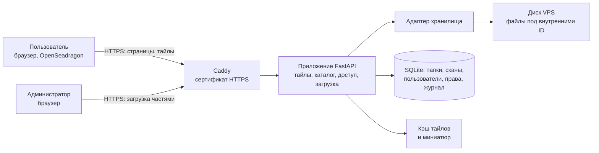

# ТЗ: веб-сервис хранения и просмотра гистосканов SVS (HemCenterHistoDigital)

Версия от 2026-09-19, редакция 3 (проект на согласование)

Редакция 2 (учебный вьювер с деидентифицированными сканами и загрузкой по SFTP) сохранена в истории git, коммит `f1117ad`.

Изменения редакции 3:

- сервис размещается на VPS провайдера is*hosting (ishosting.com) в дата-центре в Алматы и включает небольшое хранилище файлов SVS;
- сканы загружает администратор через веб-интерфейс (раньше только SFTP);
- администратор создаёт папки и подпапки и раскладывает по ним сканы;
- доступ к сканам задаётся по пользователям: «всем» или выбранным;
- логины и пароли администратор выдаёт в веб-интерфейсе (раньше из командной строки);
- ролей две: администратор и пользователь (раньше резидент, преподаватель, администратор);
- файлы загружаются как есть, с этикетками стёкол, поэтому на сервере находятся персональные данные; этикетка показывается во вьювере по кнопке тем, у кого есть доступ к скану; деидентификация и утилита для неё из работ исключены, требования к защите усилены (разделы 3 и 11);
- добавлен двухэкранный режим: сравнение двух сканов одного или разных пациентов рядом (раздел 8);
- каталог случаев с диагнозами и «слепым» режимом из редакции 2 исключён (раздел 13).

Без изменений перенесены разделы 6 и 7 и описание экрана вьювера в разделе 5: они уже реализованы и проверены.

## 1. Назначение и цели

Сервис хранит полнослайдовые гистологические сканы (WSI) на сервере в Казахстане и показывает их в браузере, подгружая только видимые фрагменты, без скачивания файла целиком. Администратор загружает сканы, раскладывает их по папкам, выдаёт учётные записи и решает, кому какие сканы видны. Пользователи только просматривают доступные им сканы онлайн.

Цели:

- разместить сервис и хранилище на VPS is*hosting в Казахстане с доступом по HTTPS только для учётных записей, выданных администратором; на первом этапе сервис доступен по IP-адресу сервера, домен подключается позже (раздел 4);
- дать администратору загрузку сканов 0,3–3 ГБ через браузер с докачкой после обрыва связи;
- дать администратору папки и подпапки, управление пользователями и доступом без командной строки;
- сохранить готовый вьювер: фиксированные увеличения и плавный зум, как в Aperio ImageScope, настройка яркости, контраста, гаммы и цвета;
- дать сравнение двух сканов рядом на одном экране, с независимой или связанной навигацией;
- гарантировать на стороне сервера, что пользователь не получит ни страницу, ни тайлы, ни миниатюру, ни этикетку скана, к которому у него нет доступа.

Сервис предназначен для просмотра, обучения и разборов. Для первичной диагностики он не используется.

## 2. Пользователи и сценарии

| Роль | Что делает |
| --- | --- |
| Администратор | Загружает сканы, создаёт папки и подпапки, перемещает и удаляет сканы, выдаёт логины и пароли, задаёт доступ, видит все сканы и журнал. Администраторов может быть несколько |
| Пользователь | Входит по выданному логину и паролю, видит только доступные ему папки и сканы, просматривает их во вьювере, может поделиться ссылкой на поле зрения с тем, у кого тоже есть доступ |

Основные сценарии:

1. Администратор создаёт папку с датой, в ней подпапки по случаям, открывает подпапку и перетаскивает в неё файлы SVS. Загрузка идёт в фоне с индикатором; после обрыва связи продолжается с места остановки.
2. Администратор создаёт учётную запись, система генерирует пароль, администратор передаёт логин и пароль пользователю. Пользователь может сменить пароль сам в профиле в любой момент.
3. Администратор открывает доступ: к папке целиком или к отдельному скану, всем пользователям или выбранным.
4. Пользователь входит, видит дерево доступных ему папок, открывает скан, смотрит на разных увеличениях, при необходимости корректирует изображение.
5. Администратор блокирует учётную запись или отзывает доступ; изменение действует сразу, без ожидания конца сессии.

## 3. Данные

**Форматы.** Обязательный формат: Aperio SVS (сжатие JPEG), сканирование на 20× и 40×, размер файла 0,3–3 ГБ. Другие форматы (NDPI, MRXS и др.) в работы не входят.

**Этикетки и персональные данные.** Файлы загружаются как есть: label-изображение (фото этикетки стекла) и macro-изображение из файла не удаляются. На этикетках могут быть персональные данные пациентов, поэтому весь сервис рассматривается как система, содержащая персональные данные и сведения, составляющие врачебную тайну:

- сервис, сканы, база и резервные копии находятся только на серверах в Казахстане (дата-центр is*hosting в Алматы); зарубежные облака не используются;
- доступ есть только у учётных записей, выданных администратором; открытых страниц, кроме страницы входа, нет;
- этикетка (label-изображение) показывается во вьювере по кнопке только тем, у кого есть доступ к скану; по умолчанию панель этикетки закрыта, каждое открытие пишется в журнал. В каталоге, на миниатюрах и в ссылках этикетки нет: миниатюры строятся только из изображения препарата. Macro-изображение не показывается;
- текстовые метаданные файла (имя файла сканера, оператор, штрихкод) не показываются и в браузер не передаются;
- действия с данными пишутся в журнал (Д-8).

Решение заказчика: сервер физически находится в Казахстане, поэтому данные казахстанских пациентов на нём хранить можно. ТЗ описывает технические меры защиты и не является юридическим заключением. Из этого решения следует одно техническое условие: копии VPS, которые делает провайдер, тоже должны оставаться в Казахстане. Заказчик подтвердил, что так и есть.

**Названия папок.** Названия папок видны в каталоге, в адресной строке их нет. В названиях папок не используются ФИО, ИИН, дата рождения и номер истории болезни. Рекомендуемая схема: папка даты, внутри подпапки случаев с внутренним номером, например `2026-09-19` → `Случай 01`, `Случай 02`. Проверить это требование программно нельзя, поэтому окно создания папки показывает напоминание, а ответственность несёт администратор.

**Названия сканов и имена файлов.** Исходные имена файлов могут содержать фамилии, поэтому:

- на диске сервера файл хранится под внутренним идентификатором; исходное имя не попадает в пути, адреса страниц, ответы сервера пользователям и журнал сервера;
- название скана в каталоге задаёт администратор; по умолчанию подставляется нейтральное название («Скан 01», «Скан 02» по порядку в папке); если имя файла соответствует шаблону `<код>_<стекло>_<окраска>.svs`, поля заполняются из него, как сейчас;
- исходное имя файла сохраняется в базе и видно только администратору в карточке скана, чтобы он мог сверить загруженное.

**Исходники.** Исходные сканы остаются в архиве Центра, на сервере хранится рабочая копия. Удаление скана с сервера необратимо.

## 4. Архитектура

Сервис и сканы размещаются на одном VPS is*hosting в Алматы. Браузер обращается только к приложению; приложение проверяет права и читает из хранилища нужные участки файла.

| Компонент | Требование |
| --- | --- |
| Клиент | Веб-приложение на чистом HTML/JS с OpenSeadragon, без сборки и без Node, без установки плагинов |
| Приложение | Python, FastAPI; чтение слайдов через OpenSlide; тайлы по протоколу DeepZoom собственным генератором (`server/tiles.py`) |
| Хранилище | Папка на диске VPS. Файлы лежат под внутренними идентификаторами (`slides/ab/ab12cd34ef56.svs`), незавершённые загрузки в отдельной папке. Дерево папок существует только в базе, поэтому переименование и перемещение мгновенны и не ломают ссылки |
| Адаптер хранилища | Единый интерфейс: сохранить, открыть, удалить, узнать свободное место. Реализация для диска сервера; S3-совместимый бакет остаётся возможным без переписывания вьювера |
| База | SQLite: папки, сканы, пользователи, права, загрузки, журнал. Для 10 учётных записей этого достаточно с большим запасом |
| Кэш | Дисковый кэш готовых тайлов, лимит объёма в конфигурации (2 ГБ для диска 30 ГБ), вытеснение по давности |
| Развёртывание | Docker Compose на уже купленном VPS is*hosting (тариф Start, Ubuntu 24). HTTPS через Caddy. Пока домена нет, адрес сервиса `https://<IP-адрес сервера>`; при появлении домена меняется одна строка в `Caddyfile` |

**HTTPS без домена.** Обычный сертификат выдаётся только на доменное имя, поэтому для работы по IP-адресу есть три варианта. Порядок проверки на этапе 1:

1. **Сертификат Let's Encrypt на IP-адрес** (профиль `shortlived`, действует около 6 дней, Caddy продлевает сам через порт 80). Браузеры ему доверяют, предупреждений нет. Let's Encrypt объявил выдачу таких сертификатов доступной всем, но поддержка в Caddy на 2026-09-19 подтверждена только сообщениями пользователей (в том числе на тестовой сборке); сработает ли в выпущенной версии, проверяется на сервере.
2. **Самоподписанный сертификат Caddy** (запасной вариант). Трафик шифруется так же, но браузер предупреждает «подключение не защищено», и каждый пользователь должен один раз подтвердить исключение. Подходит для тестирования и небольшого круга; предупреждение приучает игнорировать предупреждения, поэтому вариант временный.
3. **Обычный HTTP без шифрования не используется** ни на каком этапе: по нему пароли и сканы с этикетками шли бы открытым текстом.

Если у сервера сменится IP-адрес (например, при переустановке системы), ссылка перестанет работать и её нужно будет разослать заново. Домен снимает эту зависимость.

**Сервер.** VPS куплен 2026-09-19. Данные из панели провайдера:

| Параметр | Значение | Что это значит для проекта |
| --- | --- | --- |
| Тариф | Start - Linux SSD, размещение Kazakhstan | — |
| Процессор | Xeon, 2 × 2,60 ГГц | Хватает: тайл готовится за 15–30 мс |
| Память | 2 ГБ | Без запаса, меры ниже |
| Диск | 30 ГБ SSD | Под сканы остаётся около 16 ГБ, бюджет ниже |
| Сеть | порт 1 Гбит/с, 3 ТБ трафика в месяц, один адрес IPv4 | 3 ТБ это около 3 000 часов просмотра при 150 МБ на 10 минут; загрузка сканов на сервер расходует тот же лимит, но с запасом |
| Операционная система | Ubuntu 24 (LTS) | Подходит для Docker, поддержка обновлениями безопасности до 2029 года |
| Виртуализация | KVM | Docker работает без ограничений; можно создать файл подкачки |
| Доступ | SSH по логину и паролю (root), VNC не подключён | Настроен вход по отдельному ключу проекта. Парольный вход по решению заказчика оставлен включённым (риск принят: за первый день на пустой сервер было 89 попыток подбора; смягчает fail2ban). VNC не подключается по решению заказчика |
| Панель управления и администрирование | нет («No administration») | Сервер необслуживаемый: обновления, сетевой экран, Docker и копии настраиваем сами (этап 1) |
| Резервные копии провайдера | еженедельные | В копии попадают сканы с этикетками. Заказчик подтвердил, что копии хранятся в Казахстане |
| Защита от DDoS | нет | Приемлемо для закрытого сервиса с малым числом пользователей. Компенсируется сетевым экраном, ограничением частоты запросов на странице входа и блокировкой перебора по SSH (fail2ban). Облачные прокси-сервисы защиты не используются: трафик пошёл бы через зарубежные серверы |

Адрес сервера, его номер у провайдера и учётные данные в ТЗ и в репозиторий не записываются: репозиторий публичный. Фактические память и диск проверяются первым шагом этапа 1 (`free -h`, `df -h`).

**Память 2 ГБ.** Этого достаточно для небольшой группы, но без запаса, поэтому:

- приложение работает одним процессом, число одновременно открытых слайдов ограничено (`open_slides` в конфигурации: 4 вместо нынешних 8);
- на сервере создаётся файл подкачки 2 ГБ, чтобы пик нагрузки замедлял сервис, а не обрывал его;
- принимаемые части файла пишутся на диск сразу, в памяти не накапливаются; миниатюра строится из уменьшенного уровня, а не из полного разрешения;
- расчётное число одновременных пользователей: до 5. Если их станет больше или просмотр начнёт тормозить, у провайдера докупается память без смены тарифа, код не меняется.

**Бюджет диска 30 ГБ.** Место распределяется так:

| На что | Объём |
| --- | --- |
| Ubuntu, файл подкачки 2 ГБ, Docker, образы, журналы (с ротацией и жёстким лимитом) | до 9 ГБ |
| Кэш тайлов и миниатюр (лимит в конфигурации снижается с 20 до 2 ГБ) | 2 ГБ |
| База, её локальные копии за 7 дней | до 1 ГБ |
| Неприкосновенный резерв, чтобы диск не заполнился до отказа | 2 ГБ |
| **Сканы, включая файл, который загружается прямо сейчас** | **около 16 ГБ** |

16 ГБ это примерно 10 сканов по 1,5 ГБ или 5 сканов по 3 ГБ. Раньше в проекте ТЗ стояло 23 ГБ из расчёта на диск 40 ГБ; достаточно ли 16 ГБ, заказчик подтверждает заново (раздел 14). Хранилище работает как рабочая полка, а не архив: просмотренные сканы администратор удаляет, исходники остаются в архиве Центра. Следствия для разработки:

- принимаемый файл пишется частями сразу в один файл на том же диске и после проверки переименовывается, а не копируется, иначе скан 3 ГБ временно занимал бы 6 ГБ;
- занятое и свободное место всегда видны администратору в каталоге, при остатке меньше 4 ГБ показывается предупреждение (Х-8);
- образы Docker собираются без лишних слоёв, старые образы и журналы контейнеров чистятся автоматически: на диске 30 ГБ забытые 3–4 ГБ мусора это четверть места под сканы;
- кэш тайлов маленький, поэтому повторное открытие давно не смотренного скана может идти со скоростью первого открытия;
- провайдер продаёт дополнительное место на диске без смены тарифа; при росте объёма лимиты меняются в `config.yaml`, код не трогается.

**Что берётся из готового кода.**

| Часть | Состояние | Что делается |
| --- | --- | --- |
| Тайл-сервер, генератор тайлов, кэш тайлов, миниатюры | Готово | Без изменений |
| Вьювер: навигация (раздел 6), настройка изображения (раздел 7) | Готово | Добавляются панель этикетки и двухэкранный режим (раздел 8); панель слайдов показывает сканы текущей папки |
| Вход по паролю, сессии, bcrypt, ограничение перебора | Готово | Добавляются смена пароля, блокировка, срок действия, немедленное завершение сессий |
| Роли | `resident`, `teacher`, `admin` | Заменяются на `user` и `admin`; существующие записи переносятся |
| Проверка доступа | Только «вошёл / не вошёл» | Проверка права на каждый скан для сведений, тайлов, миниатюры и этикетки |
| Адаптер хранилища | Только чтение плоской папки | Добавляются запись и удаление, файлы под внутренними ID |
| Каталог | Синхронизация с папкой по именам файлов | Заменяется деревом папок в базе. Сверка с диском остаётся как проверка целостности («файл пропал») |
| Управление пользователями | Командная строка | Веб-экран. Командная строка остаётся для создания первого администратора |
| Журнал | Пишутся открытия сканов, экрана нет | Расширяется (Д-8), добавляется экран |
| Docker, Caddy | Написаны, не запускались | Проверка на VPS is*hosting; настройка под загрузку больших файлов |
| Утилита деидентификации | Не начата | Исключена |

**Модель данных (дополнения к существующей базе).**

| Таблица | Поля |
| --- | --- |
| `folders` | идентификатор, родительская папка, название, режим доступа, кто и когда создал |
| `slides` (дополняется) | папка, название, исходное имя файла, окраска, примечание, режим доступа, кто загрузил |
| `access_grants` | пользователь и папка либо скан |
| `uploads` | незавершённые загрузки: папка назначения, размер, принятые части, кто и когда начал |
| `users` (дополняется) | состояние (активен, заблокирован), срок действия, признак «сменить пароль при входе», версия сессии |
| `audit_log` | время, пользователь, действие, объект, IP-адрес |

## 5. Интерфейс

### 5.1. Экран вьювера

Компоновка экрана повторяет Aperio ImageScope: слева список слайдов, в центре изображение, поверх него панель увеличений и мини-карта, внизу строка состояния. Строка меню и большая часть панели инструментов убраны.

| Зона | Расположение | Содержимое |
| --- | --- | --- |
| Верхняя панель | Сверху, одна строка высотой до 48 px | Название скана и путь по папкам; кнопки: «Каталог», «Сравнить», «Настройка изображения», «Этикетка», «Сброс вида», «Во весь экран», «Ссылка на поле зрения»; имя пользователя и выход |
| Панель слайдов | Слева, ширина 180–200 px, сворачивается | Миниатюры сканов текущей папки, доступных пользователю, с подписью. Клик открывает скан в основном окне |
| Основное окно | Центр, всё оставшееся место | Изображение слайда. Перетаскивание мышью, зум колесом |
| Панель увеличений | Поверх изображения, слева вверху | Вертикальный ряд кнопок: Fit, 2×, 4×, 10×, 20×, 40×; ползунок; поле с текущим увеличением (например, 4,8×) на жёлтом фоне, как в ImageScope |
| Мини-карта | Поверх изображения, справа вверху | Обзор всего препарата с рамкой текущего поля зрения. Клик или перетаскивание рамки перемещает вид. Сворачивается |
| Панель этикетки | Поверх изображения, справа под мини-картой, открывается кнопкой «Этикетка» | Label-изображение из файла, можно повернуть на 90°. По умолчанию закрыта. Если этикетки в файле нет, кнопка неактивна |
| Масштабная линейка | Поверх изображения, слева внизу | Отрезок с подписью в мкм или мм, пересчитывается при зуме |
| Панель настройки изображения | Выдвигается справа, ширина около 300 px | Ползунки из раздела 7. Не перекрывает панель увеличений и мини-карту |
| Строка состояния | Снизу, одна строка | Размер изображения в пикселях, координаты курсора, текущее увеличение, размер пикселя (мкм), индикатор загрузки тайлов |

Двухэкранный режим описан в разделе 8.

Что убрано по сравнению с ImageScope: строка меню, инструменты аннотаций и измерений, анализ изображений, экспорт областей, одновременный просмотр более двух сканов.

### 5.2. Каталог и экраны администратора

| Экран | Кому | Содержимое |
| --- | --- | --- |
| Каталог | Всем | Слева дерево папок, справа сканы выбранной папки: миниатюра, название, окраска, увеличение сканирования, дата добавления. Путь по папкам («хлебные крошки»), поиск по названию скана среди доступных |
| Каталог, режим администратора | Администратору | Дополнительно: «Новая папка», «Загрузить сканы», «Доступ», переименование, перемещение, удаление; значок доступа на каждой папке и скане (только администраторы, все, число выбранных пользователей); зона перетаскивания файлов; панель хода загрузок; занятое и свободное место на диске |
| Окно «Доступ» | Администратору | Режим доступа, группы и пользователи с отметками, подпись «унаследовано от папки …» или «задано здесь» |
| Пользователи | Администратору | Таблица: логин, имя, роль, группы, состояние, срок действия, последний вход. Действия: создать (с выбором групп), изменить группы, сбросить пароль, заблокировать, удалить, «Что видит этот пользователь» |
| Группы | Администратору | Список групп с числом участников; создание, переименование, удаление, состав группы. «Администраторы» показана как встроенная и не редактируется |
| Журнал | Администратору | Список событий с фильтрами по пользователю, действию и дате; выгрузка в CSV |
| Профиль | Всем | Смена своего пароля |

Требования к оформлению:

- светлая нейтральная тема, фон вокруг препарата светло-серый, чтобы не искажать восприятие окраски;
- язык интерфейса русский, все строки через словарь `i18n.js`, что допускает добавление казахского и английского;
- минимальная поддерживаемая ширина экрана 1280 px; на планшете панель слайдов свёрнута по умолчанию;
- все элементы управления имеют всплывающие подсказки и доступны с клавиатуры;
- необратимые действия (удаление скана, папки, пользователя) требуют подтверждения с указанием, что именно будет удалено.

## 6. Навигация и увеличения

Увеличение показывается в привычных микроскопических единицах (2×–40×) и рассчитывается от объектива сканирования, записанного в метаданных файла.

| № | Требование |
| --- | --- |
| Н-1 | Кнопки фиксированных увеличений: Fit (весь препарат), 2×, 4×, 10×, 20×, 40×. Кнопки выше увеличения сканирования неактивны (скан 20× не предлагает 40×) |
| Н-2 | Плавный зум колесом мыши с центром в точке курсора, ползунком, жестом на сенсорном экране. Диапазон: от Fit до 2× от увеличения сканирования (цифровой зум), далее зум ограничен |
| Н-3 | Текущее увеличение отображается числом с одним знаком после запятой и обновляется в реальном времени |
| Н-4 | Если в метаданных нет объектива, увеличение вычисляется из размера пикселя (0,25 мкм/пиксель ≈ 40×, 0,5 мкм/пиксель ≈ 20×). Если нет и его, показывается процент от полного разрешения |
| Н-5 | Панорамирование перетаскиванием мышью, стрелками клавиатуры, перетаскиванием рамки на мини-карте |
| Н-6 | При смене увеличения сначала показывается растянутый тайл с предыдущего уровня, затем он заменяется чётким. Пустых белых областей во время загрузки быть не должно |
| Н-7 | Масштабная линейка в мкм или мм, корректная на любом увеличении |
| Н-8 | Горячие клавиши: `0` Fit, `1`–`5` фиксированные увеличения, `+`/`−` зум, стрелки панорамирование, `F` полный экран, `R` сброс вида |
| Н-9 | Ссылка на поле зрения: адрес страницы содержит слайд, координаты центра и увеличение. Открытие ссылки восстанавливает вид. Ссылку создаёт любой пользователь; открыть её сможет только тот, у кого есть доступ к этим сканам (Д-5) |
| Н-10 | Поворот изображения с шагом 90° (желательное требование) |

## 7. Настройка изображения

Все коррекции выполняются в браузере поверх уже загруженных тайлов (WebGL-шейдер или эквивалент). Исходный файл не меняется, повторная загрузка тайлов при движении ползунка не происходит.

| Параметр | Диапазон | По умолчанию | Назначение |
| --- | --- | --- | --- |
| Яркость | −100…+100 | 0 | Общий сдвиг светлоты |
| Контраст | −100…+100 | 0 | Растяжение или сжатие тонового диапазона |
| Гамма | 0,20…3,00 | 1,00 | Нелинейная коррекция средних тонов: проработка ядер в плотных, перекрашенных участках |
| Насыщенность | −100…+100 | 0 | Усиление бледной окраски; −100 даёт оттенки серого |
| Оттенок | −180°…+180° | 0° | Поворот цветового круга: компенсация сдвига цвета сканера или выцветшей окраски |
| Баланс красного | −100…+100 | 0 | Коррекция каналов по отдельности, как Color Balance в ImageScope |
| Баланс зелёного | −100…+100 | 0 | То же |
| Баланс синего | −100…+100 | 0 | То же |

Требования к поведению:

| № | Требование |
| --- | --- |
| И-1 | Результат виден в реальном времени при движении ползунка, без заметной задержки (не менее 30 кадров/с на встроенной графике) |
| И-2 | У каждого ползунка есть числовое поле для точного ввода. Двойной клик по ползунку возвращает значение по умолчанию |
| И-3 | Кнопка «Сбросить всё» возвращает все параметры к значениям по умолчанию |
| И-4 | Кнопка «До/После»: при удержании показывает исходное изображение без коррекций |
| И-5 | Порядок применения фиксирован и описан в документации: баланс каналов → яркость и контраст → гамма → насыщенность и оттенок |
| И-6 | Коррекции применяются ко всем уровням увеличения одинаково и сохраняются при зуме и панорамировании |
| И-7 | Настройки запоминаются для пользователя в браузере отдельно по каждому слайду. При открытии слайда с сохранёнными настройками на кнопке панели виден индикатор |
| И-8 | Пресеты: «Исходное», «Бледная окраска» (контраст и насыщенность выше), «Перекрашенный препарат» (гамма и яркость выше). Значения пресетов согласуются с заказчиком на тестовых сканах |
| И-9 | Пипетка белого: клик по пустому фону стекла выставляет баланс каналов так, чтобы фон стал нейтрально-белым (желательное требование) |
| И-10 | Мини-карта и миниатюры в панели слайдов показываются без коррекций |
| И-11 | Ссылка на поле зрения (Н-9) по выбору пользователя включает текущие настройки изображения |

## 8. Двухэкранный режим (сравнение двух сканов)

Режим показывает два скана рядом на одном экране: например, H&E и ИГХ одного пациента или препараты двух разных пациентов. Сканы могут быть из разных папок, с разным увеличением сканирования (20× и 40×) и разного размера. Каждая половина экрана это полноценный вьювер с требованиями разделов 6 и 7.

| № | Требование |
| --- | --- |
| С-1 | Вход в режим: кнопка «Сравнить» в верхней панели вьювера открывает выбор второго скана (дерево папок и поиск, как в каталоге, только доступные пользователю сканы); в каталоге можно отметить два скана и нажать «Сравнить». Выход: кнопка «Один экран», остаётся активная половина |
| С-2 | Экран делится пополам по вертикали, разделитель перетаскивается мышью (от 30 до 70 %), двойной клик по разделителю возвращает 50 %. Кнопка «Поменять местами» |
| С-3 | У каждой половины свои название скана, мини-карта, масштабная линейка, поле текущего увеличения и, по кнопке, панель этикетки. Названия и этикетки обеих половин видны одновременно, чтобы сканы нельзя было перепутать |
| С-4 | Активная половина выделена рамкой и выбирается кликом. Панель увеличений, горячие клавиши (Н-8) и панель настройки изображения действуют на активную половину. Строка состояния показывает данные половины под курсором |
| С-5 | Навигация по умолчанию независимая: у каждой половины свои положение, увеличение и поворот |
| С-6 | Кнопка «Связать» включает синхронную навигацию: сдвиг, зум и поворот в одной половине повторяются в другой. Связь относительная: в момент включения запоминается взаимное положение, поэтому сначала пользователь вручную совмещает одинаковые участки (сдвигом и поворотом с шагом 90°), затем связывает |
| С-7 | При связанной навигации уравнивается увеличение в микроскопических единицах (10× слева это 10× справа), а сдвиг пересчитывается в микрометрах, а не в пикселях. Поэтому сканы 20× и 40× движутся согласованно. Если в одной половине достигнут предел зума, вторая дальше не увеличивается |
| С-8 | Общий курсор: при связанной навигации положение указателя мыши в одной половине показывается перекрестием в соответствующей точке другой (желательное требование) |
| С-9 | Настройка изображения (раздел 7) у каждой половины своя и запоминается по скану, как в обычном режиме (И-7). Кнопка «Применить к обеим» копирует настройки активной половины во вторую |
| С-10 | Панель слайдов слева в двухэкранном режиме свёрнута; клик по миниатюре заменяет скан в активной половине |
| С-11 | Ссылка на поле зрения (Н-9) в двухэкранном режиме содержит оба скана, вид каждой половины и признак связи. Она открывается, только если у получателя есть доступ к обоим сканам; иначе он видит сообщение «нет доступа к одному из сканов» без его названия |
| С-12 | Право доступа проверяется сервером для каждого скана отдельно (Д-4). В журнал пишется открытие каждого из двух сканов |
| С-13 | Режим рассчитан на экран шириной от 1280 px. На более узком экране и на планшете в вертикальной ориентации кнопка «Сравнить» неактивна |
| С-14 | Скорость: при работе двух половин показатели прорисовки из раздела 11 выполняются для каждой половины; настройка изображения даёт не менее 30 кадров/с на встроенной графике при обеих активных коррекциях |

Реализация на готовом коде: два экземпляра OpenSeadragon и два экземпляра слоя коррекции из `web/static/js/adjust.js` (WebGL-canvas поверх каждого). Сервер не меняется: он отдаёт тайлы двух сканов теми же маршрутами. Нагрузка на сервер от одного пользователя в этом режиме примерно вдвое выше: пять человек, которые одновременно сравнивают сканы, нагружают сервер как десять обычных. На 2 ГБ памяти фактический предел замеряется на этапе 3; если его не хватит, у провайдера докупается память и увеличивается `open_slides`, код не меняется.

В двухэкранный режим не входят: больше двух сканов одновременно, наложение одного скана на другой с прозрачностью, автоматическое совмещение срезов.

## 9. Хранилище, папки и загрузка

Все действия этого раздела доступны только администратору.

| № | Требование |
| --- | --- |
| Х-1 | Папки и подпапки: создание, переименование, перемещение, удаление. Вложенность до 5 уровней. Сканы могут лежать в папке любого уровня |
| Х-2 | Название папки до 100 символов, уникально в пределах родительской папки. Окно создания и переименования показывает напоминание: без ФИО, ИИН, даты рождения и номера истории болезни |
| Х-3 | Папки существуют только в базе, файлы лежат на диске под внутренними ID. Переименование и перемещение не трогают файлы и не ломают ссылки на поле зрения |
| Х-4 | Загрузка через браузер: кнопка выбора файлов или перетаскивание в открытую папку, несколько файлов за раз. Принимаются только файлы `.svs`, предельный размер файла задаётся в конфигурации (по умолчанию 4 ГБ) |
| Х-5 | Файл передаётся частями по 8–16 МБ, целостность каждой части проверяется контрольной суммой. Индикатор показывает процент, скорость и оставшееся время. Загрузку можно отменить |
| Х-6 | Докачка: после обрыва связи, закрытия вкладки или перезапуска сервера загрузка продолжается с последней принятой части, а не с начала. Одновременно передаётся не более двух файлов, остальные ждут в очереди |
| Х-7 | После приёма сервер открывает файл через OpenSlide, читает метаданные, создаёт миниатюру и только затем показывает скан в каталоге. Файл, который не открылся, удаляется, администратор видит понятную причину |
| Х-8 | Перед началом загрузки сервер проверяет свободное место с учётом всех файлов в очереди и отказывает, если после загрузки останется меньше резерва (в конфигурации, по умолчанию 2 ГБ). В сообщении указано, сколько места нужно освободить. Каталог администратора всегда показывает занятое и свободное место и предупреждает при остатке меньше 4 ГБ |
| Х-9 | Поля скана, которые правит администратор: название, окраска, примечание. Технические поля заполняются автоматически: размер в пикселях, увеличение сканирования, размер пикселя, размер файла, дата загрузки, кто загрузил |
| Х-10 | Перемещение сканов между папками, в том числе нескольких сразу. Если у скана нет своего режима доступа, после перемещения действует доступ новой папки; окно перемещения об этом предупреждает |
| Х-11 | Удаление скана стирает файл, миниатюру и кэш тайлов. Удаление непустой папки возможно только после подтверждения, в котором указано число подпапок и сканов |
| Х-12 | Если в хранилище уже есть файл с тем же исходным именем и размером, администратор получает предупреждение о возможном дубликате и решает, продолжать ли |
| Х-13 | Прерванные загрузки видны в панели загрузок: файл, папка назначения, принятая доля и кнопки «Продолжить» и «Удалить». «Продолжить» просит указать тот же файл (браузер не может открыть его сам) и досылает остаток. Загрузки, не пополнявшиеся дольше 3 дней, и временные файлы без записи в базе удаляются автоматически при проверке хранилища: на диске 30 ГБ брошенная загрузка отнимает заметную долю места |
| Х-14 | Скачивание исходного файла SVS через веб-интерфейс недоступно никому |
| Х-15 | Импорт из папки «Входящие», куда администратор кладёт файлы по SFTP: для больших партий, когда загрузка через браузер неудобна (желательное требование) |

## 10. Пользователи и доступ

### 10.1. Учётные записи

| № | Требование |
| --- | --- |
| П-1 | Роли: администратор (всё) и пользователь (только просмотр доступных сканов). Самостоятельной регистрации нет |
| П-2 | Экран «Пользователи»: создание (логин, имя, роль, необязательный срок действия), сброс пароля, блокировка и разблокировка, удаление |
| П-3 | Выдача пароля: администратор либо вводит пароль сам, либо оставляет поле пустым, и тогда система создаёт случайный пароль не короче 12 символов. Пароль показывается один раз с кнопкой «Скопировать». На сервере хранится только хэш (bcrypt) |
| П-4 | Обязательной смены пароля при первом входе нет (решение заказчика): выданный пароль работает сразу. Администратору выданный пароль известен, поэтому пользователям рекомендуется сменить его в профиле; пароль, который пользователь задаёт себе, не короче 10 символов |
| П-5 | Пользователь меняет свой пароль на экране «Профиль». Забытый пароль сбрасывает администратор; восстановления по электронной почте нет |
| П-6 | После даты окончания срока действия вход невозможен. Администратор видит истёкшие записи в таблице |
| П-7 | Блокировка, удаление, сброс и смена пароля немедленно завершают все сессии пользователя |
| П-8 | Нельзя удалить или заблокировать последнего администратора и собственную учётную запись |
| П-9 | Перебор паролей ограничен (уже реализовано); неудачные попытки входа пишутся в журнал |
| П-10 | Первый администратор создаётся командой на сервере, как сейчас |
| П-11 | Двухфакторный вход для администратора по одноразовому коду из приложения (желательное требование) |

### 10.2. Доступ к сканам

| № | Требование |
| --- | --- |
| Д-1 | Режим доступа задаётся у папки или у отдельного скана: «Только администраторы», «Все пользователи», «Выбранные пользователи» (список). Новая папка верхнего уровня создаётся в режиме «Только администраторы» |
| Д-2 | Наследование: подпапка или скан без своего режима получают режим ближайшей папки выше. Свой режим заменяет унаследованный, а не дополняет его: внутри папки «для всех» можно закрыть одну подпапку для выбранных пользователей. Окно «Доступ» показывает, откуда режим взят |
| Д-3 | Пользователь видит в каталоге только доступные ему сканы и только те папки, внутри которых на любом уровне есть хотя бы один доступный скан |
| Д-4 | Сервер проверяет право на каждый запрос: сведения о скане, тайлы, миниатюра, этикетка. На скан без доступа ответ такой же, как на несуществующий («не найден»). Macro-изображение не отдаётся никому |
| Д-5 | Ссылка на поле зрения открывается только у вошедшего пользователя с доступом к этому скану |
| Д-6 | Изменение доступа действует со следующего запроса, без повторного входа |
| Д-7 | «Что видит этот пользователь»: администратор выбирает пользователя и получает список доступных ему папок и сканов |
| Д-8 | Журнал: вход и выход, неудачные попытки входа, открытие скана, открытие этикетки, загрузка, перемещение и удаление сканов и папок, изменение доступа, действия с учётными записями. Хранится не менее года. Экран журнала доступен только администратору. Исходные имена файлов и пароли в журнал не пишутся |
| Д-9 | Группы пользователей. Заведены «Патологи», «Гематологи», «Резиденты»; администратор может создавать новые, переименовывать и удалять их. Пользователь может входить в несколько групп. «Администраторы» это не отдельная группа, а роль «администратор»: у неё всегда есть доступ ко всему, в окне «Доступ» она показана только как подпись |
| Д-10 | В режиме «Выбранные» доступ выдаётся пользователям и группам. Действующее право это объединение: прямое разрешение пользователя плюс разрешения всех его групп. Добавление в группу и исключение из неё, удаление группы действуют со следующего запроса, как и остальные изменения доступа (Д-6) |

## 11. Нефункциональные требования

Целевые показатели просмотра измеряются на канале 20 Мбит/с и слайде 1 ГБ.

| Показатель | Значение |
| --- | --- |
| Первое открытие слайда до обзорного вида | до 5 с |
| Повторное открытие (тайлы в кэше) | до 3 с |
| Полная прорисовка экрана после зума или сдвига | до 1,5 с |
| Одновременных пользователей без деградации | 5 на тарифе Start (2 vCPU, 2 ГБ ОЗУ); всего до 10 учётных записей |
| Трафик на 10 минут просмотра одного слайда | до 150 МБ |
| Загрузка скана | Скорость ограничена только каналом администратора (1 ГБ на 20 Мбит/с ≈ 7–8 минут). После обрыва теряется не больше одной части |
| Просмотр во время загрузки | Загрузка администратором не замедляет просмотр заметно для пользователей |

**Безопасность.** Сервис содержит персональные данные, поэтому:

- только HTTPS, заголовок HSTS; cookie сессии с признаками `Secure`, `HttpOnly`, `SameSite`; запросы, меняющие данные, защищены от подделки с других сайтов (проверка заголовка `Origin`);
- сайт закрыт от поисковых систем (`robots.txt` и заголовок `X-Robots-Tag: noindex`), открытая страница одна: вход;
- тайлы, миниатюры и этикетки отдаются только по сессии пользователя с правом на этот скан; тайлы и миниатюры с заголовком `Cache-Control: private`, этикетка с `Cache-Control: no-store`, чтобы она не оставалась в кэше браузера на общем компьютере;
- вход только по логину и паролю, без ограничения по IP-адресам (решение заказчика);
- персональные данные остаются внутри файлов на диске, поэтому доступ к серверу по SSH есть только у администратора сервера, а резервные копии провайдера и снимки диска считаются такими же защищаемыми данными, как сам сервер;
- приложение читает и пишет только папку хранилища и папку данных; секреты (ключ подписи сессий) лежат в переменных окружения на сервере и не попадают в репозиторий;
- сервер необслуживаемый, поэтому защита настраивается нами: сетевой экран (ufw) пропускает только порты 80, 443 и SSH; вход по SSH возможен по ключу проекта, вход по паролю оставлен включённым по решению заказчика (принятый риск), перебор блокируется (fail2ban); обновления безопасности Ubuntu ставятся автоматически (unattended-upgrades);
- защиты от DDoS у провайдера нет: Caddy ограничивает частоту запросов к странице входа и к загрузке; зарубежные прокси-сервисы защиты не подключаются;
- в репозиторий с кодом никогда не попадают сканы, база, `config.yaml` и `.env` (уже исключены в `.gitignore`);
- полностью исключить копирование изображения пользователем, у которого есть доступ (снимок экрана), технически невозможно; доступ выдаётся только тем, кому он действительно нужен.

**Прочее.**

- **Браузеры.** Две последние версии Chrome, Edge, Firefox, Safari. Планшеты iPad и Android в горизонтальной ориентации. Загрузка сканов рассчитана на настольный браузер.
- **Размещение данных.** Сервис, сканы и база находятся на VPS is*hosting в дата-центре в Алматы. Провайдер бесплатно делает еженедельные копии VPS; по подтверждению заказчика они хранятся в Казахстане.
- **Надёжность.** Недоступность хранилища показывается понятным сообщением, а не пустым экраном. Сервис перезапускается автоматически. Сбой во время загрузки не оставляет в каталоге повреждённых сканов.
- **Резервное копирование.** База (папки, права, пользователи, журнал) копируется ежедневно; на сервере хранятся копии за 7 дней (диск 30 ГБ), администратор может скачать копию базы на компьютер Центра. В базе нет изображений, только названия, права и журнал. Сканы восстанавливаются повторной загрузкой из архива Центра.
- **Сопровождение.** Исходный код в репозитории, инструкция по развёртыванию на VPS is*hosting, описание конфигурации, инструкция администратора (загрузка, папки, пользователи, доступ) с картинками.
- **Лицензии.** Только компоненты с открытыми лицензиями (OpenSeadragon BSD, OpenSlide LGPL).

## 12. Этапы и приёмка

Сроки ориентировочные, для одного разработчика. Этап 1 идёт первым намеренно: файлы Docker ещё ни разу не запускались, и хостинг лучше проверить до основной разработки.

| Этап | Состав | Срок | Результат |
| --- | --- | --- | --- |
| 1. Сервер на is*hosting | VPS куплен (Ubuntu 24, 2 ГБ ОЗУ, диск 30 ГБ). Вход по SSH по ключу проекта (уже настроен), сетевой экран, fail2ban, автоматические обновления, файл подкачки 2 ГБ (уже сделаны); установка Docker с лимитом журналов; развёртывание готового вьювера (Docker, Caddy); HTTPS по IP-адресу (раздел 4: сначала сертификат Let's Encrypt на IP, запасной вариант самоподписанный); ежедневная копия базы; замер показателей просмотра. Домен `hemcenterhistodigital.kz` регистрируется позже, по решению заказчика | 1 неделя | Вьювер работает по HTTPS на IP-адресе. До конца этапа 2 на сервер загружаются только сканы без персональных данных: разграничения доступа ещё нет |
| 2. Хранилище и доступ | Дерево папок; загрузка через браузер с докачкой; роли «администратор» и «пользователь»; группы «Патологи», «Гематологи», «Резиденты»; экран пользователей и групп, выдача паролей; доступ к папкам и сканам с проверкой на сервере; панель этикетки; журнал с экраном; перенос существующей базы; инструкция администратора | 3–4 недели | Сервис готов к работе с реальными сканами |
| 3. Двухэкранный режим | Раздел 8: два вьювера рядом, выбор второго скана, активная половина, связанная навигация с пересчётом в микрометрах, настройки изображения по половинам, ссылка на два скана. Серверная часть не меняется, поэтому этап можно выполнять до этапа 2 или параллельно с ним | 1,5–2 недели | Сравнение двух сканов работает на сканах 20× и 40× |
| 4. Желательные доработки | Общий курсор в двухэкранном режиме (С-8), импорт из папки SFTP, двухфакторный вход администратора, S3-бакет при росте объёма | по необходимости | — |

Критерии приёмки этапа 1:

- [ ] Сервис открывается по `https://<IP-адрес>`; без авторизации доступна только страница входа; трафик шифруется (при самоподписанном сертификате браузер показывает предупреждение, которое пользователь подтверждает один раз)
- [ ] Вход по SSH по ключу работает; снаружи открыты только порты 80, 443 и SSH (проверка сканированием портов)
- [ ] После развёртывания система, Docker и файл подкачки занимают не больше 9 ГБ; под сканы свободно не меньше 16 ГБ
- [ ] Показатели просмотра из раздела 11 выполнены на трёх тестовых слайдах
- [ ] Копия базы создаётся ежедневно, восстановление из копии проверено

Критерии приёмки этапа 2:

- [ ] Администратор через браузер загружает SVS размером не менее 1 ГБ; после принудительного обрыва связи загрузка продолжается, а не начинается заново
- [ ] Повреждённый или не-SVS файл не появляется в каталоге, администратор видит причину
- [ ] Администратор создаёт папку, подпапку, переименовывает и перемещает их; ссылка на поле зрения, сохранённая до перемещения, продолжает работать
- [ ] Администратор создаёт пользователя, получает сгенерированный пароль; с этим паролем пользователь входит сразу, без принудительной смены; в профиле он меняет пароль сам, после чего прежние сессии этой учётной записи прекращаются
- [ ] Пользователь А видит только выданные ему сканы; прямой запрос сведений, тайла, миниатюры и этикетки чужого скана возвращает «не найден» (проверка по вкладке «Сеть» и прямым адресам)
- [ ] Подпапка с режимом «Выбранные пользователи» внутри папки «Все пользователи» не видна остальным
- [ ] Блокировка пользователя и отзыв доступа действуют сразу, без повторного входа
- [ ] Этикетка открывается по кнопке у пользователя с доступом к скану, открытие видно в журнале; в каталоге и на миниатюрах этикетки нет; macro-изображение прямым запросом получить нельзя
- [ ] При нехватке места загрузка не начинается, администратор видит, сколько нужно освободить; во время загрузки скана 3 ГБ на диске не появляется его вторая копия
- [ ] Исходные имена файлов не встречаются в интерфейсе пользователя, в ответах сервера пользователю и в журнале сервера
- [ ] В журнале видны вход, открытие скана, загрузка, изменение доступа
- [ ] Нельзя удалить последнего администратора
- [ ] Навигация и настройка изображения (разделы 6 и 7) работают как раньше, `tests/smoke_test.py` проходит и дополнен проверками доступа

Критерии приёмки этапа 3:

- [ ] Два скана из разных папок открываются рядом; названия обеих половин видны одновременно, этикетка каждой открывается по кнопке
- [ ] Кнопки увеличений, горячие клавиши и панель настройки изображения действуют только на активную половину; «Применить к обеим» копирует настройки
- [ ] Связанная навигация на паре сканов 20× и 40×: после совмещения и включения связи одинаковые участки остаются совмещёнными при сдвиге, зуме и повороте; поля увеличения в обеих половинах показывают одно значение
- [ ] Ссылка на поле зрения из двухэкранного режима восстанавливает оба скана и вид; у пользователя без доступа ко второму скану она не раскрывает его название
- [ ] Прорисовка каждой половины укладывается в показатели раздела 11; настройка изображения не ниже 30 кадров/с на встроенной графике
- [ ] На экране уже 1280 px кнопка «Сравнить» неактивна

## 13. Вне рамок

В работы не входят, но архитектура не должна им мешать:

- деидентификация сканов и утилита для неё (исключены в редакции 3);
- каталог случаев с учебной темой, диагнозом и «слепым» режимом (был этапом 2 в редакции 2);
- самостоятельная регистрация и восстановление пароля по электронной почте;
- скачивание исходных файлов через веб-интерфейс;
- аннотации (контуры, стрелки, подписи) и измерения расстояний и площадей;
- одновременный просмотр более двух сканов, наложение сканов с прозрачностью, автоматическое совмещение срезов;
- интеграция с ЛИС и МИС Центра;
- поддержка DICOM WSI и форматов других сканеров (NDPI, MRXS, SCN, CZI);
- автоматический анализ изображений.

## 14. Открытые вопросы

Решено заказчиком: формат SVS; хостинг is*hosting, VPS в Казахстане куплен 2026-09-19 (тариф Start: 2 vCPU, 2 ГБ ОЗУ, диск 30 ГБ, Ubuntu 24); загрузка сканов администратором через веб; папки и подпапки без ФИО в названиях; доступ по пользователям или всем; пользователи только просматривают.

Решено 2026-09-19 дополнительно:

- сервер находится в Казахстане, поэтому данные казахстанских пациентов на нём хранятся; файлы загружаются с этикетками, этикетка показывается во вьювере по кнопке тем, у кого есть доступ к скану;
- добавлен двухэкранный режим сравнения двух сканов (раздел 8);
- вход на сервер по ключу проекта настроен; парольный вход по SSH оставлен включённым, VNC не подключается (решение заказчика, риск принят);
- для входа в сервис достаточно логина и пароля, ограничения по IP нет;
- названия сканов нейтральные по умолчанию, исходное имя файла видно только администратору;
- домен пока не регистрируется, сервис работает по IP-адресу; целевое имя `hemcenterhistodigital.kz` (на 2026-09-19 не занято), для зоны .kz сайт должен находиться на сервере в Казахстане, это условие выполняется;
- копии VPS у провайдера хранятся в Казахстане (со слов заказчика);
- название в интерфейсе: HemCenterHistoDigital;
- группы «Патологи», «Гематологи», «Резиденты»; «Администраторы» это роль администратора;
- обязательной смены выданного пароля при первом входе нет;
- около 16 ГБ под сканы на диске 30 ГБ для тестирования достаточно; при переходе к постоянной работе объём пересматривается, место у провайдера докупается без смены тарифа;
- порядок этапов: сначала хранилище и доступ (этап 2), затем двухэкранный режим (этап 3);
- пользователей до 10, из них одновременно работают до 5. Тарифа Start для этого достаточно; ограничение даёт память, а не число учётных записей.

Остаётся уточнить (в скобках вариант, заложенный в ТЗ по умолчанию):

- [ ] У кого, кроме разработчика, будет SSH-ключ от сервера?
