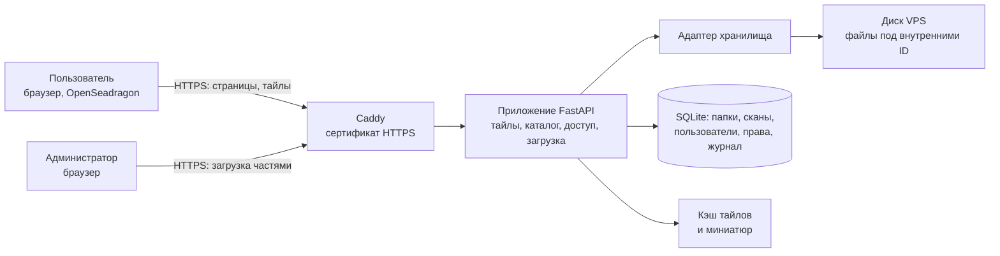

# ТЗ: веб-сервис хранения и просмотра гистосканов SVS (HemCenterHistoDigital)

Версия от 2026-09-19, редакция 4

Редакция 2 (учебный вьювер с деидентифицированными сканами и загрузкой по SFTP) сохранена в истории git, коммит `f1117ad`.

Изменения редакции 4 (2026-09-19, по итогам аудита; отчёт удалён 2026-09-20 после выполнения этапов 4–9, остался в истории git: `git show c7c1ec5:docs/audit-2026-09-19.md`):

- этапы 1–3 выполнены, сервис развёрнут и работает; их состояние отмечено в разделе 12;
- раздел 13 переписан: вместо замыслов «на будущее» в нём план работ из этапов 4–10 с требованиями, критериями приёмки и обоснованием порядка;
- в план вошли находки аудита: три нерабочие функции двухэкранного режима, время по UTC, слабая докачка, медленное первое открытие скана, мёртвый код, замечания по понятности интерфейса;
- в план вошли работы, о которых заказчик просил раньше: верхняя панель значками, работа с телефона, аннотации для обучения, продолжение загрузки без повторного выбора файла;
- в раздел 15 добавлены вопросы, ответы на которые нужны до этапа 9.

**Работа продолжается с раздела 13, этап 4.**

Изменения редакции 3:

- сервис размещается на VPS провайдера is*hosting (ishosting.com) в дата-центре в Алматы и включает небольшое хранилище файлов SVS;
- сканы загружает администратор через веб-интерфейс (раньше только SFTP);
- администратор создаёт папки и подпапки и раскладывает по ним сканы;
- доступ к сканам задаётся по пользователям: «всем» или выбранным;
- логины и пароли администратор выдаёт в веб-интерфейсе (раньше из командной строки);
- ролей две: администратор и пользователь (раньше резидент, преподаватель, администратор);
- файлы загружаются как есть, с этикетками стёкол, поэтому на сервере находятся персональные данные; этикетка показывается во вьювере по кнопке тем, у кого есть доступ к скану; деидентификация и утилита для неё из работ исключены, требования к защите усилены (разделы 3 и 11);
- добавлен двухэкранный режим: сравнение двух сканов одного или разных пациентов рядом (раздел 8);
- каталог случаев с диагнозами и «слепым» режимом из редакции 2 исключён (раздел 14).

Без изменений перенесены разделы 6 и 7 и описание экрана вьювера в разделе 5: они уже реализованы и проверены.

## 1. Назначение и цели

Сервис хранит полнослайдовые гистологические сканы (WSI) на сервере в Казахстане и показывает их в браузере, подгружая только видимые фрагменты, без скачивания файла целиком. Администратор загружает сканы, раскладывает их по папкам, выдаёт учётные записи и решает, кому какие сканы видны. Пользователи только просматривают доступные им сканы онлайн.

Цели:

- разместить сервис и хранилище на VPS is*hosting в Казахстане с доступом по HTTPS только для учётных записей, выданных администратором; на первом этапе сервис доступен по IP-адресу сервера, домен подключается позже (раздел 4);
- дать администратору загрузку сканов 0,3–3 ГБ через браузер с докачкой после обрыва связи;
- дать администратору папки и подпапки, управление пользователями и доступом без командной строки;
- сохранить готовый вьювер: фиксированные увеличения и плавный зум, как в Aperio ImageScope, настройка яркости, контраста, гаммы и цвета;
- дать сравнение двух сканов рядом на одном экране, с независимой или связанной навигацией;
- гарантировать на стороне сервера, что пользователь не получит ни страницу, ни тайлы, ни миниатюру, ни этикетку скана, к которому у него нет доступа.

Сервис предназначен для просмотра, обучения и разборов. Для первичной диагностики он не используется.

## 2. Пользователи и сценарии

| Роль | Что делает |
| --- | --- |
| Администратор | Загружает сканы, создаёт папки и подпапки, перемещает и удаляет сканы, выдаёт логины и пароли, задаёт доступ, видит все сканы и журнал. Администраторов может быть несколько |
| Пользователь | Входит по выданному логину и паролю, видит только доступные ему папки и сканы, просматривает их во вьювере, может поделиться ссылкой на поле зрения с тем, у кого тоже есть доступ |

Основные сценарии:

1. Администратор создаёт папку с датой, в ней подпапки по случаям, открывает подпапку и перетаскивает в неё файлы SVS. Загрузка идёт в фоне с индикатором; после обрыва связи продолжается с места остановки.
2. Администратор создаёт учётную запись, система генерирует пароль, администратор передаёт логин и пароль пользователю. Пользователь может сменить пароль сам в профиле в любой момент.
3. Администратор открывает доступ: к папке целиком или к отдельному скану, всем пользователям или выбранным.
4. Пользователь входит, видит дерево доступных ему папок, открывает скан, смотрит на разных увеличениях, при необходимости корректирует изображение.
5. Администратор блокирует учётную запись или отзывает доступ; изменение действует сразу, без ожидания конца сессии.

## 3. Данные

**Форматы.** Основной формат: Aperio SVS (сжатие JPEG), сканирование на 20× и 40×, размер файла 0,3–3 ГБ. По решению заказчика от 2026-09-19 принимаются и другие однофайловые форматы, которые читает OpenSlide: Hamamatsu `.ndpi`, Leica `.scn`, Philips `.tiff`, Ventana `.bif` и `.tif`, Zeiss `.czi`, ARGOS `.avs`, Sakura `.svslide`, Huron и обычный пирамидальный `.tif`. Многофайловые форматы (MIRAX `.mrxs`, Hamamatsu `.vms`/`.vmu`, DICOM, Trestle) не принимаются: загрузка идёт по одному файлу. KFB (сканеры KFBio) принят в работу 2026-09-19 решением заказчика: OpenSlide его не читает, поэтому он читается через библиотеку ASlide (см. «Формат KFB» ниже).

**Формат KFB: как устроено, ограничения и риски.** Решение заказчика от 2026-09-19.

- Чтение: `server/kfb.py` подключает KFB-часть ASlide (github.com/MrPeterJin/ASlide), которая оборачивает закрытую библиотеку производителя `libkfbslide.so`. В образ Docker ставится только эта часть (2,4 МБ из 300 МБ пакета); коммит ASlide и контрольная сумма SHA-256 каждого файла закреплены в `tools/install_aslide_kfb.py`, подменённый или недокачанный файл сборку не проходит.
- Проверено на настоящем скане KFBio (80 224 × 60 064, 432 МБ): размер пикселя читается из файла, увеличение 40× вычисляется по нему; этикетка есть и показывается по кнопке; тайл 5–30 мс, обзорный тайл и миниатюра при первом обращении около 1 с (дальше из кэша); память процесса около 110 МБ.
- Ограничение: только Linux. Рабочий сервер подходит; при локальной разработке на Windows файл `.kfb` отклоняется сразу, до передачи, с сообщением «Чтение KFB на этом сервере не установлено». Проверять KFB нужно в образе Docker.
- Ограничение: обращения к одному KFB-файлу идут по очереди (под замком): неизвестно, выдерживает ли закрытая библиотека одновременное чтение. При пяти одновременных зрителях одного скана запас по скорости есть (тайл 5–30 мс).
- В ASlide найдена и обойдена ошибка: она освобождала буфер этикетки, принадлежащий библиотеке KFBio, и второе чтение этикетки роняло весь процесс сервиса. Этикетка читается собственным кодом. Обновление ASlide требует повторной проверки на настоящем файле.
- Риск, правовой: закрытая библиотека KFBio распространяется автором ASlide без подтверждённого разрешения производителя («для учебных целей», производитель вправе потребовать её удаления). Лицензия SDK не ясна. Рекомендуется спросить у поставщика сканера, разрешено ли такое использование. Если библиотека исчезнет из репозитория, собранный образ продолжит работать, а новая сборка — нет; запасной путь — конвертация KFB в SVS или TIFF программой KFBio до загрузки.
- Риск, безопасность: закрытый машинный код из стороннего репозитория работает в одном процессе с сервисом, у которого есть доступ к сканам и базе. Проверить его содержимое нельзя; контрольные суммы защищают только от подмены после закрепления.
- Риск, лицензия кода: ASlide распространяется под GPL-3.0, репозиторий сервиса публичный. Лицензия самого сервиса должна быть совместима с GPL-3.0; сейчас лицензия у проекта не указана, решение за заказчиком.

**Этикетки и персональные данные.** Файлы загружаются как есть: label-изображение (фото этикетки стекла) и macro-изображение из файла не удаляются. На этикетках могут быть персональные данные пациентов, поэтому весь сервис рассматривается как система, содержащая персональные данные и сведения, составляющие врачебную тайну:

- сервис, сканы, база и резервные копии находятся только на серверах в Казахстане (дата-центр is*hosting в Алматы); зарубежные облака не используются;
- доступ есть только у учётных записей, выданных администратором; открытых страниц, кроме страницы входа, нет;
- этикетка (label-изображение) показывается во вьювере по кнопке только тем, у кого есть доступ к скану; по умолчанию панель этикетки закрыта, каждое открытие пишется в журнал. В каталоге, на миниатюрах и в ссылках этикетки нет: миниатюры строятся только из изображения препарата. Macro-изображение не показывается;
- текстовые метаданные файла (имя файла сканера, оператор, штрихкод) не показываются и в браузер не передаются;
- действия с данными пишутся в журнал (Д-8).

Решение заказчика: сервер физически находится в Казахстане, поэтому данные казахстанских пациентов на нём хранить можно. ТЗ описывает технические меры защиты и не является юридическим заключением. Из этого решения следует одно техническое условие: копии VPS, которые делает провайдер, тоже должны оставаться в Казахстане. Заказчик подтвердил, что так и есть.

**Названия папок.** Названия папок видны в каталоге, в адресной строке их нет. В названиях папок не используются ФИО, ИИН, дата рождения и номер истории болезни. Рекомендуемая схема: папка даты, внутри подпапки случаев с внутренним номером, например `2026-09-19` → `Случай 01`, `Случай 02`. Проверить это требование программно нельзя, поэтому окно создания папки показывает напоминание, а ответственность несёт администратор.

**Названия сканов и имена файлов.** Исходные имена файлов могут содержать фамилии, поэтому:

- на диске сервера файл хранится под внутренним идентификатором; исходное имя не попадает в пути, адреса страниц, ответы сервера пользователям и журнал сервера;
- название скана в каталоге задаёт администратор; по умолчанию подставляется нейтральное название («Скан 01», «Скан 02» по порядку в папке); если имя файла соответствует шаблону `<код>_<стекло>_<окраска>.<формат>`, поля заполняются из него, как сейчас;
- исходное имя файла сохраняется в базе и видно только администратору в карточке скана, чтобы он мог сверить загруженное.

**Исходники.** Исходные сканы остаются в архиве Центра, на сервере хранится рабочая копия. Удаление скана с сервера необратимо.

## 4. Архитектура

Сервис и сканы размещаются на одном VPS is*hosting в Алматы. Браузер обращается только к приложению; приложение проверяет права и читает из хранилища нужные участки файла.

| Компонент | Требование |
| --- | --- |
| Клиент | Веб-приложение на чистом HTML/JS с OpenSeadragon, без сборки и без Node, без установки плагинов |
| Приложение | Python, FastAPI; чтение слайдов через OpenSlide; тайлы по протоколу DeepZoom собственным генератором (`server/tiles.py`) |
| Хранилище | Папка на диске VPS. Файлы лежат под внутренними идентификаторами с расширением своего формата (`slides/ab/ab12cd34ef56.svs`, `…ndpi`): часть форматов OpenSlide узнаёт по расширению. Незавершённые загрузки в отдельной папке. Дерево папок существует только в базе, поэтому переименование и перемещение мгновенны и не ломают ссылки |
| Адаптер хранилища | Единый интерфейс: сохранить, открыть, удалить, узнать свободное место. Реализация для диска сервера; S3-совместимый бакет остаётся возможным без переписывания вьювера |
| База | SQLite: папки, сканы, пользователи, права, загрузки, журнал. Для 10 учётных записей этого достаточно с большим запасом |
| Кэш | Дисковый кэш готовых тайлов, лимит объёма в конфигурации (2 ГБ для диска 30 ГБ), вытеснение по давности |
| Развёртывание | Docker Compose на уже купленном VPS is*hosting (тариф Start, Ubuntu 24). HTTPS через Caddy. Пока домена нет, адрес сервиса `https://<IP-адрес сервера>`; при появлении домена меняется одна строка в `Caddyfile` |

**HTTPS без домена.** Обычный сертификат выдаётся только на доменное имя, поэтому для работы по IP-адресу есть три варианта. Порядок проверки на этапе 1:

1. **Сертификат Let's Encrypt на IP-адрес** (профиль `shortlived`, действует около 6 дней, Caddy продлевает сам через порт 80). Браузеры ему доверяют, предупреждений нет. Let's Encrypt объявил выдачу таких сертификатов доступной всем, но поддержка в Caddy на 2026-09-19 подтверждена только сообщениями пользователей (в том числе на тестовой сборке); сработает ли в выпущенной версии, проверяется на сервере.
2. **Самоподписанный сертификат Caddy** (запасной вариант). Трафик шифруется так же, но браузер предупреждает «подключение не защищено», и каждый пользователь должен один раз подтвердить исключение. Подходит для тестирования и небольшого круга; предупреждение приучает игнорировать предупреждения, поэтому вариант временный.
3. **Обычный HTTP без шифрования не используется** ни на каком этапе: по нему пароли и сканы с этикетками шли бы открытым текстом.

Если у сервера сменится IP-адрес (например, при переустановке системы), ссылка перестанет работать и её нужно будет разослать заново. Домен снимает эту зависимость.

**Сервер.** VPS куплен 2026-09-19. Данные из панели провайдера:

| Параметр | Значение | Что это значит для проекта |
| --- | --- | --- |
| Тариф | Start - Linux SSD, размещение Kazakhstan | — |
| Процессор | Xeon, 2 × 2,60 ГГц | Хватает: тайл готовится за 15–30 мс |
| Память | 2 ГБ | Без запаса, меры ниже |
| Диск | 30 ГБ SSD | Под сканы остаётся около 16 ГБ, бюджет ниже |
| Сеть | порт 1 Гбит/с, 3 ТБ трафика в месяц, один адрес IPv4 | 3 ТБ это около 3 000 часов просмотра при 150 МБ на 10 минут; загрузка сканов на сервер расходует тот же лимит, но с запасом |
| Операционная система | Ubuntu 24 (LTS) | Подходит для Docker, поддержка обновлениями безопасности до 2029 года |
| Виртуализация | KVM | Docker работает без ограничений; можно создать файл подкачки |
| Доступ | SSH по логину и паролю (root), VNC не подключён | Настроен вход по отдельному ключу проекта. Парольный вход по решению заказчика оставлен включённым (риск принят: за первый день на пустой сервер было 89 попыток подбора; смягчает fail2ban). VNC не подключается по решению заказчика |
| Панель управления и администрирование | нет («No administration») | Сервер необслуживаемый: обновления, сетевой экран, Docker и копии настраиваем сами (этап 1) |
| Резервные копии провайдера | еженедельные | В копии попадают сканы с этикетками. Заказчик подтвердил, что копии хранятся в Казахстане |
| Защита от DDoS | нет | Приемлемо для закрытого сервиса с малым числом пользователей. Компенсируется сетевым экраном, ограничением частоты запросов на странице входа и блокировкой перебора по SSH (fail2ban). Облачные прокси-сервисы защиты не используются: трафик пошёл бы через зарубежные серверы |

Адрес сервера, его номер у провайдера и учётные данные в ТЗ и в репозиторий не записываются: репозиторий публичный. Фактические память и диск проверяются первым шагом этапа 1 (`free -h`, `df -h`).

**Память 2 ГБ.** Этого достаточно для небольшой группы, но без запаса, поэтому:

- приложение работает одним процессом, число одновременно открытых слайдов ограничено (`open_slides` в конфигурации: 4 вместо нынешних 8);
- на сервере создаётся файл подкачки 2 ГБ, чтобы пик нагрузки замедлял сервис, а не обрывал его (увеличен до 4 ГБ 2026-09-22 под оценку клеточности, этап 11);
- принимаемые части файла пишутся на диск сразу, в памяти не накапливаются; миниатюра строится из уменьшенного уровня, а не из полного разрешения;
- расчётное число одновременных пользователей: до 5. Если их станет больше или просмотр начнёт тормозить, у провайдера докупается память без смены тарифа, код не меняется.

**Бюджет диска 30 ГБ.** Место распределяется так:

| На что | Объём |
| --- | --- |
| Ubuntu, файл подкачки 4 ГБ (до 2026-09-22 — 2 ГБ), Docker, образы, журналы (с ротацией и жёстким лимитом) | до 11 ГБ |
| Кэш тайлов и миниатюр (лимит в конфигурации снижается с 20 до 2 ГБ) | 2 ГБ |
| База, её локальные копии за 7 дней | до 1 ГБ |
| Неприкосновенный резерв, чтобы диск не заполнился до отказа | 2 ГБ |
| **Сканы, включая файл, который загружается прямо сейчас** | **около 16 ГБ** |

16 ГБ это примерно 10 сканов по 1,5 ГБ или 5 сканов по 3 ГБ. Раньше в проекте ТЗ стояло 23 ГБ из расчёта на диск 40 ГБ; достаточно ли 16 ГБ, заказчик подтверждает заново (раздел 14). Хранилище работает как рабочая полка, а не архив: просмотренные сканы администратор удаляет, исходники остаются в архиве Центра. Следствия для разработки:

- принимаемый файл пишется частями сразу в один файл на том же диске и после проверки переименовывается, а не копируется, иначе скан 3 ГБ временно занимал бы 6 ГБ;
- занятое и свободное место всегда видны администратору в каталоге, при остатке меньше 4 ГБ показывается предупреждение (Х-8);
- образы Docker собираются без лишних слоёв, старые образы и журналы контейнеров чистятся автоматически: на диске 30 ГБ забытые 3–4 ГБ мусора это четверть места под сканы;
- кэш тайлов маленький, поэтому повторное открытие давно не смотренного скана может идти со скоростью первого открытия;
- провайдер продаёт дополнительное место на диске без смены тарифа; при росте объёма лимиты меняются в `config.yaml`, код не трогается.

**Что берётся из готового кода.**

| Часть | Состояние | Что делается |
| --- | --- | --- |
| Тайл-сервер, генератор тайлов, кэш тайлов, миниатюры | Готово | Без изменений |
| Вьювер: навигация (раздел 6), настройка изображения (раздел 7) | Готово | Добавляются панель этикетки и двухэкранный режим (раздел 8); панель слайдов показывает сканы текущей папки |
| Вход по паролю, сессии, bcrypt, ограничение перебора | Готово | Добавляются смена пароля, блокировка, срок действия, немедленное завершение сессий |
| Роли | `resident`, `teacher`, `admin` | Заменяются на `user` и `admin`; существующие записи переносятся |
| Проверка доступа | Только «вошёл / не вошёл» | Проверка права на каждый скан для сведений, тайлов, миниатюры и этикетки |
| Адаптер хранилища | Только чтение плоской папки | Добавляются запись и удаление, файлы под внутренними ID |
| Каталог | Синхронизация с папкой по именам файлов | Заменяется деревом папок в базе. Сверка с диском остаётся как проверка целостности («файл пропал») |
| Управление пользователями | Командная строка | Веб-экран. Командная строка остаётся для создания первого администратора |
| Журнал | Пишутся открытия сканов, экрана нет | Расширяется (Д-8), добавляется экран |
| Docker, Caddy | Написаны, не запускались | Проверка на VPS is*hosting; настройка под загрузку больших файлов |
| Утилита деидентификации | Не начата | Исключена |

**Модель данных (дополнения к существующей базе).**

| Таблица | Поля |
| --- | --- |
| `folders` | идентификатор, родительская папка, название, режим доступа, кто и когда создал |
| `slides` (дополняется) | папка, название, исходное имя файла, окраска, примечание, режим доступа, кто загрузил |
| `access_grants` | пользователь и папка либо скан |
| `uploads` | незавершённые загрузки: папка назначения, размер, принятые части, кто и когда начал |
| `users` (дополняется) | состояние (активен, заблокирован), срок действия, признак «сменить пароль при входе», версия сессии |
| `audit_log` | время, пользователь, действие, объект, IP-адрес |

## 5. Интерфейс

### 5.1. Экран вьювера

Компоновка экрана повторяет Aperio ImageScope: слева список слайдов, в центре изображение, поверх него панель увеличений и мини-карта, внизу строка состояния. Строка меню и большая часть панели инструментов убраны.

| Зона | Расположение | Содержимое |
| --- | --- | --- |
| Верхняя панель | Сверху, одна строка высотой до 48 px | Название скана и путь по папкам; кнопки: «Каталог», «Сравнить», «Настройка изображения», «Этикетка», «Сброс вида», «Во весь экран», «Ссылка на поле зрения»; имя пользователя и выход |
| Панель слайдов | Слева, ширина 180–200 px, сворачивается | Миниатюры сканов текущей папки, доступных пользователю, с подписью. Клик открывает скан в основном окне |
| Основное окно | Центр, всё оставшееся место | Изображение слайда. Перетаскивание мышью, зум колесом |
| Панель увеличений | Поверх изображения, слева вверху, сворачивается | Вертикальный ряд кнопок: Fit, 4×, 10×, 20×, 40×; поле с текущим увеличением (например, 4,8×) на жёлтом фоне, как в ImageScope; ниже кнопки «Рулетка», «Привязка» (при сравнении) и «Поворот». По умолчанию развёрнута; кнопкой сворачивается до одного значка. Решение заказчика 2026-09-21: панель остаётся столбиком слева, а не переезжает в строку состояния — перенос вниз освободил бы меньше четверти процента экрана, а мышь увёл бы от препарата |
| Мини-карта | Поверх изображения, справа вверху | Обзор всего препарата с рамкой текущего поля зрения. Клик или перетаскивание рамки перемещает вид. Сворачивается |
| Панель этикетки | Поверх изображения, справа под мини-картой, открывается кнопкой «Этикетка» | Label-изображение из файла, можно повернуть на 90°. По умолчанию закрыта. Если этикетки в файле нет, кнопка неактивна |
| Масштабная линейка | Поверх изображения, слева внизу | Отрезок с подписью в мкм или мм, пересчитывается при зуме |
| Панель настройки изображения | Выдвигается справа, ширина около 300 px | Ползунки из раздела 7. Не перекрывает панель увеличений и мини-карту |
| Строка состояния | Снизу, одна строка | Текущее увеличение активной половины, пометка «отражено» у зеркального скана (Т-3), сообщения о загрузке тайлов. Размер изображения, размер пикселя и увеличение сканирования перенесены в окно «Сведения о скане» (ИН-16, этап 7), координаты курсора удалены (КД-6). На телефоне остаётся только увеличение (М-4) |

Двухэкранный режим описан в разделе 8.

Что убрано по сравнению с ImageScope: строка меню, инструменты аннотаций и измерений, анализ изображений, экспорт областей, одновременный просмотр более двух сканов.

### 5.2. Каталог и экраны администратора

| Экран | Кому | Содержимое |
| --- | --- | --- |
| Каталог | Всем | Слева дерево папок, справа сканы выбранной папки: миниатюра, название, окраска, увеличение сканирования, дата добавления. Путь по папкам («хлебные крошки»), поиск по названию скана среди доступных |
| Каталог, режим администратора | Администратору | Дополнительно: «Новая папка», «Загрузить сканы», «Доступ», переименование, перемещение, удаление; значок доступа на каждой папке и скане (только администраторы, все, число выбранных пользователей); зона перетаскивания файлов; панель хода загрузок; занятое и свободное место на диске |
| Окно «Доступ» | Администратору | Режим доступа, группы и пользователи с отметками, подпись «унаследовано от папки …» или «задано здесь» |
| Пользователи | Администратору | Таблица: логин, имя, роль, группы, состояние, срок действия, последний вход. Действия: создать (с выбором групп), изменить группы, сбросить пароль, заблокировать, удалить, «Что видит этот пользователь» |
| Группы | Администратору | Список групп с числом участников; создание, переименование, удаление, состав группы. «Администраторы» показана как встроенная и не редактируется |
| Журнал | Администратору | Список событий с фильтрами по пользователю, действию и дате; выгрузка в CSV |
| Профиль | Всем | Смена своего пароля |

Требования к оформлению:

- светлая нейтральная тема, фон вокруг препарата светло-серый, чтобы не искажать восприятие окраски;
- язык интерфейса русский, все строки через словарь `i18n.js`, что допускает добавление казахского и английского;
- минимальная поддерживаемая ширина экрана 1280 px; на планшете панель слайдов свёрнута по умолчанию;
- все элементы управления имеют всплывающие подсказки и доступны с клавиатуры;
- необратимые действия (удаление скана, папки, пользователя) требуют подтверждения с указанием, что именно будет удалено.

## 6. Навигация и увеличения

Увеличение показывается в привычных микроскопических единицах (2×–40×) и рассчитывается от объектива сканирования, записанного в метаданных файла.

| № | Требование |
| --- | --- |
| Н-1 | Кнопки фиксированных увеличений: Fit (весь препарат), 4×, 10×, 20×, 40×. Кнопка 2× убрана решением заказчика 2026-09-21: на микроскопе увеличения начинаются с 4×. Кнопки выше увеличения сканирования неактивны (скан 20× не предлагает 40×) |
| Н-2 | Плавный зум колесом мыши с центром в точке курсора и жестом на сенсорном экране. Ползунок убран в этапе 10 (Т-1): он дублировал колесо. Диапазон: от Fit до 2× от увеличения сканирования (цифровой зум), далее зум ограничен |
| Н-3 | Текущее увеличение отображается числом с одним знаком после запятой и обновляется в реальном времени |
| Н-4 | Если в метаданных нет объектива, увеличение вычисляется из размера пикселя (0,25 мкм/пиксель ≈ 40×, 0,5 мкм/пиксель ≈ 20×). Если нет и его, показывается процент от полного разрешения |
| Н-5 | Панорамирование перетаскиванием мышью, стрелками клавиатуры, перетаскиванием рамки на мини-карте |
| Н-6 | При смене увеличения сначала показывается растянутый тайл с предыдущего уровня, затем он заменяется чётким. Пустых белых областей во время загрузки быть не должно |
| Н-7 | Масштабная линейка в мкм или мм, корректная на любом увеличении |
| Н-8 | Горячие клавиши: `0` Fit, `1`–`4` фиксированные увеличения, `+`/`−` зум, стрелки панорамирование, `F` полный экран, `R` сброс вида |
| Н-9 | Ссылка на поле зрения: адрес страницы содержит слайд, координаты центра и увеличение. Открытие ссылки восстанавливает вид. Ссылку создаёт любой пользователь; открыть её сможет только тот, у кого есть доступ к этим сканам (Д-5) |
| Н-10 | Поворот изображения. Изначально желательное требование с шагом 90°; в этапе 10 расширено до произвольного угла от −180° до 180° и зеркального отражения (Т-2, Т-3) |

## 7. Настройка изображения

Все коррекции выполняются в браузере поверх уже загруженных тайлов (WebGL-шейдер или эквивалент). Исходный файл не меняется, повторная загрузка тайлов при движении ползунка не происходит.

| Параметр | Диапазон | По умолчанию | Назначение |
| --- | --- | --- | --- |
| Яркость | −100…+100 | 0 | Общий сдвиг светлоты |
| Контраст | −100…+100 | 0 | Растяжение или сжатие тонового диапазона |
| Гамма | 0,20…3,00 | 1,00 | Нелинейная коррекция средних тонов: проработка ядер в плотных, перекрашенных участках |
| Насыщенность | −100…+100 | 0 | Усиление бледной окраски; −100 даёт оттенки серого |
| Оттенок | −180°…+180° | 0° | Поворот цветового круга: компенсация сдвига цвета сканера или выцветшей окраски |
| Баланс красного | −100…+100 | 0 | Коррекция каналов по отдельности, как Color Balance в ImageScope |
| Баланс зелёного | −100…+100 | 0 | То же |
| Баланс синего | −100…+100 | 0 | То же |

Требования к поведению:

| № | Требование |
| --- | --- |
| И-1 | Результат виден в реальном времени при движении ползунка, без заметной задержки (не менее 30 кадров/с на встроенной графике) |
| И-2 | У каждого ползунка есть числовое поле для точного ввода. Двойной клик по ползунку возвращает значение по умолчанию |
| И-3 | Кнопка «Сбросить всё» возвращает все параметры к значениям по умолчанию |
| И-4 | Кнопка «До/После»: при удержании показывает исходное изображение без коррекций |
| И-5 | Порядок применения фиксирован и описан в документации: баланс каналов → яркость и контраст → гамма → насыщенность и оттенок |
| И-6 | Коррекции применяются ко всем уровням увеличения одинаково и сохраняются при зуме и панорамировании |
| И-7 | Настройки запоминаются для пользователя в браузере отдельно по каждому слайду. При открытии слайда с сохранёнными настройками на кнопке панели виден индикатор |
| И-8 | Пресеты: «Исходное», «Бледная окраска» (контраст и насыщенность выше), «Перекрашенный препарат» (гамма и яркость выше). Значения пресетов согласуются с заказчиком на тестовых сканах |
| И-9 | Пипетка белого: клик по пустому фону стекла выставляет баланс каналов так, чтобы фон стал нейтрально-белым (желательное требование) |
| И-10 | Мини-карта и миниатюры в панели слайдов показываются без коррекций |
| И-11 | Ссылка на поле зрения (Н-9) по выбору пользователя включает текущие настройки изображения |

## 8. Двухэкранный режим (сравнение двух сканов)

Режим показывает два скана рядом на одном экране: например, H&E и ИГХ одного пациента или препараты двух разных пациентов. Сканы могут быть из разных папок, с разным увеличением сканирования (20× и 40×) и разного размера. Каждая половина экрана это полноценный вьювер с требованиями разделов 6 и 7.

| № | Требование |
| --- | --- |
| С-1 | Вход в режим: кнопка «Сравнить» в верхней панели вьювера открывает выбор второго скана (дерево папок и поиск, как в каталоге, только доступные пользователю сканы); в каталоге можно отметить два скана и нажать «Сравнить». Выход: кнопка «Один экран», остаётся активная половина |
| С-2 | Экран делится пополам по вертикали, разделитель перетаскивается мышью (от 30 до 70 %), двойной клик по разделителю возвращает 50 %. Кнопка «Поменять местами» |
| С-3 | У каждой половины свои название скана, мини-карта, масштабная линейка, поле текущего увеличения и, по кнопке, панель этикетки. Названия и этикетки обеих половин видны одновременно, чтобы сканы нельзя было перепутать |
| С-4 | Активная половина выделена рамкой и выбирается кликом. Горячие клавиши (Н-8) и панель настройки изображения действуют на активную половину, строка состояния показывает её данные. Панель увеличений и поворот действуют сразу на обе половины: сравнивать сканы имеет смысл в одинаковом масштабе и одинаковой ориентации (решение заказчика 2026-09-19, подтверждено 2026-09-20). Зеркальное отражение — только у активной половины (Т-3) |
| С-5 | Навигация по умолчанию независимая: у каждой половины свои положение, увеличение и поворот |
| С-6 | Кнопка «Связать» включает синхронную навигацию: сдвиг, зум и поворот в одной половине повторяются в другой. Связь относительная: в момент включения запоминается взаимное положение, поэтому сначала пользователь вручную совмещает одинаковые участки (сдвигом и поворотом), затем связывает. С этапа 10 связь можно задать точнее — привязкой по ориентирам (С-10) — и поправлять на ходу с `Shift` (С-11) |
| С-7 | При связанной навигации уравнивается увеличение в микроскопических единицах (10× слева это 10× справа), а сдвиг пересчитывается в микрометрах, а не в пикселях. Поэтому сканы 20× и 40× движутся согласованно. Если в одной половине достигнут предел зума, вторая дальше не увеличивается |
| С-8 | Общий курсор: при связанной навигации положение указателя мыши в одной половине показывается перекрестием в соответствующей точке другой. **Сделано 2026-09-21** в этапе 10 (раздел 13.7): 2026-09-20 заказчик сначала отказался от него, затем в тот же день вернул — «отличное предложение» |
| С-9 | Настройка изображения (раздел 7) у каждой половины своя и запоминается по скану, как в обычном режиме (И-7). Кнопка «Применить к обеим» копирует настройки активной половины во вторую |
| С-10 | Панель слайдов слева в двухэкранном режиме свёрнута; клик по миниатюре заменяет скан в активной половине |
| С-11 | Ссылка на поле зрения (Н-9) в двухэкранном режиме содержит оба скана, вид каждой половины и признак связи. Она открывается, только если у получателя есть доступ к обоим сканам; иначе он видит сообщение «нет доступа к одному из сканов» без его названия |
| С-12 | Право доступа проверяется сервером для каждого скана отдельно (Д-4). В журнал пишется открытие каждого из двух сканов |
| С-13 | Режим включается, если под две половины остаётся не меньше 820 точек по ширине. Считается рабочая область, а не всё окно: при масштабировании Windows 150–200 % экран 2256 точек даёт браузеру около 1128, и проверка по окну запрещала бы сравнение без причины. Панель стёкол при включении сворачивается и освобождает место. Если ширины всё же не хватает, сервис предлагает развернуть окно |
| С-14 | Скорость: при работе двух половин показатели прорисовки из раздела 11 выполняются для каждой половины; настройка изображения даёт не менее 30 кадров/с на встроенной графике при обеих активных коррекциях |

Реализация на готовом коде: два экземпляра OpenSeadragon и два экземпляра слоя коррекции из `web/static/js/adjust.js` (WebGL-canvas поверх каждого). Сервер не меняется: он отдаёт тайлы двух сканов теми же маршрутами. Нагрузка на сервер от одного пользователя в этом режиме примерно вдвое выше: пять человек, которые одновременно сравнивают сканы, нагружают сервер как десять обычных. На 2 ГБ памяти фактический предел замеряется на этапе 3; если его не хватит, у провайдера докупается память и увеличивается `open_slides`, код не меняется.

В двухэкранный режим не входят: больше двух сканов одновременно, наложение одного скана на другой с прозрачностью, автоматическое совмещение срезов.

## 9. Хранилище, папки и загрузка

Все действия этого раздела доступны только администратору.

| № | Требование |
| --- | --- |
| Х-1 | Папки и подпапки: создание, переименование, перемещение, удаление. Вложенность до 5 уровней. Сканы могут лежать в папке любого уровня |
| Х-2 | Название папки до 100 символов, уникально в пределах родительской папки. Окно создания и переименования показывает напоминание: без ФИО, ИИН, даты рождения и номера истории болезни |
| Х-3 | Папки существуют только в базе, файлы лежат на диске под внутренними ID. Переименование и перемещение не трогают файлы и не ломают ссылки на поле зрения |
| Х-4 | Загрузка через браузер: кнопка выбора файлов или перетаскивание в открытую папку, несколько файлов за раз. Принимаются однофайловые форматы сканов из раздела 3 (`.svs`, `.ndpi`, `.scn`, `.tiff`, `.tif`, `.bif`, `.czi`, `.avs`, `.svslide`) и KFB (`.kfb`), предельный размер файла задаётся в конфигурации (по умолчанию 4 ГБ). Файл, который не открывается как скан, в каталог не попадает |
| Х-5 | Файл передаётся частями по 8–16 МБ, целостность каждой части проверяется контрольной суммой. Индикатор показывает процент, скорость и оставшееся время. Загрузку можно отменить |
| Х-6 | Докачка: после обрыва связи, закрытия вкладки или перезапуска сервера загрузка продолжается с последней принятой части, а не с начала. Одновременно передаётся не более двух файлов, остальные ждут в очереди |
| Х-7 | После приёма сервер открывает файл через OpenSlide, читает метаданные, создаёт миниатюру и только затем показывает скан в каталоге. Файл, который не открылся, удаляется, администратор видит понятную причину |
| Х-8 | Перед началом загрузки сервер проверяет свободное место с учётом всех файлов в очереди и отказывает, если после загрузки останется меньше резерва (в конфигурации, по умолчанию 2 ГБ). В сообщении указано, сколько места нужно освободить. Каталог администратора всегда показывает занятое и свободное место и предупреждает при остатке меньше 4 ГБ |
| Х-9 | Поля скана, которые правит администратор: название, окраска, примечание. Технические поля заполняются автоматически: размер в пикселях, увеличение сканирования, размер пикселя, размер файла, дата загрузки, кто загрузил |
| Х-10 | Перемещение сканов между папками, в том числе нескольких сразу. Если у скана нет своего режима доступа, после перемещения действует доступ новой папки; окно перемещения об этом предупреждает |
| Х-11 | Удаление скана стирает файл, миниатюру и кэш тайлов. Удаление непустой папки возможно только после подтверждения, в котором указано число подпапок и сканов |
| Х-12 | Если в хранилище уже есть файл с тем же исходным именем и размером, администратор получает предупреждение о возможном дубликате и решает, продолжать ли |
| Х-13 | Прерванные загрузки видны в панели загрузок: файл, папка назначения, принятая доля и кнопки «Продолжить» и «Удалить». «Продолжить» просит указать тот же файл (браузер не может открыть его сам) и досылает остаток. Загрузки, не пополнявшиеся дольше 3 дней, и временные файлы без записи в базе удаляются автоматически при проверке хранилища: на диске 30 ГБ брошенная загрузка отнимает заметную долю места |
| Х-14 | Скачивание исходного файла SVS через веб-интерфейс недоступно никому |
| Х-15 | Импорт из папки «Входящие», куда администратор кладёт файлы по SFTP: для больших партий, когда загрузка через браузер неудобна (желательное требование) |

## 10. Пользователи и доступ

### 10.1. Учётные записи

| № | Требование |
| --- | --- |
| П-1 | Роли: администратор (всё) и пользователь (только просмотр доступных сканов). Самостоятельной регистрации нет |
| П-2 | Экран «Пользователи»: создание (логин, имя, роль, необязательный срок действия), сброс пароля, блокировка и разблокировка, удаление |
| П-3 | Выдача пароля: администратор либо вводит пароль сам, либо оставляет поле пустым, и тогда система создаёт случайный пароль не короче 12 символов. Пароль показывается один раз с кнопкой «Скопировать». На сервере хранится только хэш (bcrypt) |
| П-4 | Обязательной смены пароля при первом входе нет (решение заказчика): выданный пароль работает сразу. Администратору выданный пароль известен, поэтому пользователям рекомендуется сменить его в профиле; пароль, который пользователь задаёт себе, не короче 10 символов |
| П-5 | Пользователь меняет свой пароль на экране «Профиль». Забытый пароль сбрасывает администратор; восстановления по электронной почте нет |
| П-6 | После даты окончания срока действия вход невозможен. Администратор видит истёкшие записи в таблице |
| П-7 | Блокировка, удаление, сброс и смена пароля немедленно завершают все сессии пользователя |
| П-8 | Нельзя удалить или заблокировать последнего администратора и собственную учётную запись |
| П-9 | Перебор паролей ограничен (уже реализовано); неудачные попытки входа пишутся в журнал |
| П-10 | Первый администратор создаётся командой на сервере, как сейчас |
| П-11 | Двухфакторный вход для администратора по одноразовому коду из приложения (желательное требование) |

### 10.2. Доступ к сканам

| № | Требование |
| --- | --- |
| Д-1 | Режим доступа задаётся у папки или у отдельного скана: «Только администраторы», «Все пользователи», «Выбранные пользователи» (список). Новая папка верхнего уровня создаётся в режиме «Только администраторы» |
| Д-2 | Наследование: подпапка или скан без своего режима получают режим ближайшей папки выше. Свой режим заменяет унаследованный, а не дополняет его: внутри папки «для всех» можно закрыть одну подпапку для выбранных пользователей. Окно «Доступ» показывает, откуда режим взят |
| Д-3 | Пользователь видит в каталоге только доступные ему сканы и только те папки, внутри которых на любом уровне есть хотя бы один доступный скан |
| Д-4 | Сервер проверяет право на каждый запрос: сведения о скане, тайлы, миниатюра, этикетка. На скан без доступа ответ такой же, как на несуществующий («не найден»). Macro-изображение не отдаётся никому |
| Д-5 | Ссылка на поле зрения открывается только у вошедшего пользователя с доступом к этому скану |
| Д-6 | Изменение доступа действует со следующего запроса, без повторного входа |
| Д-7 | «Что видит этот пользователь»: администратор выбирает пользователя и получает список доступных ему папок и сканов |
| Д-8 | Журнал: вход и выход, неудачные попытки входа, открытие скана, открытие этикетки, загрузка, перемещение и удаление сканов и папок, изменение доступа, действия с учётными записями. Хранится не менее года. Экран журнала доступен только администратору. Исходные имена файлов и пароли в журнал не пишутся |
| Д-9 | Группы пользователей. Заведены «Патологи», «Гематологи», «Резиденты»; администратор может создавать новые, переименовывать и удалять их. Пользователь может входить в несколько групп. «Администраторы» это не отдельная группа, а роль «администратор»: у неё всегда есть доступ ко всему, в окне «Доступ» она показана только как подпись |
| Д-10 | В режиме «Выбранные» доступ выдаётся пользователям и группам. Действующее право это объединение: прямое разрешение пользователя плюс разрешения всех его групп. Добавление в группу и исключение из неё, удаление группы действуют со следующего запроса, как и остальные изменения доступа (Д-6) |

## 11. Нефункциональные требования

Целевые показатели просмотра измеряются на канале 20 Мбит/с и слайде 1 ГБ.

| Показатель | Значение |
| --- | --- |
| Первое открытие слайда до обзорного вида | до 5 с |
| Повторное открытие (тайлы в кэше) | до 3 с |
| Полная прорисовка экрана после зума или сдвига | до 1,5 с |
| Одновременных пользователей без деградации | 5 на тарифе Start (2 vCPU, 2 ГБ ОЗУ); всего до 10 учётных записей |
| Трафик на 10 минут просмотра одного слайда | до 150 МБ |
| Загрузка скана | Скорость ограничена только каналом администратора (1 ГБ на 20 Мбит/с ≈ 7–8 минут). После обрыва теряется не больше одной части |
| Просмотр во время загрузки | Загрузка администратором не замедляет просмотр заметно для пользователей |

**Безопасность.** Сервис содержит персональные данные, поэтому:

- только HTTPS, заголовок HSTS; cookie сессии с признаками `Secure`, `HttpOnly`, `SameSite`; запросы, меняющие данные, защищены от подделки с других сайтов (проверка заголовка `Origin`);
- сайт закрыт от поисковых систем (`robots.txt` и заголовок `X-Robots-Tag: noindex`), открытая страница одна: вход;
- тайлы, миниатюры и этикетки отдаются только по сессии пользователя с правом на этот скан; тайлы и миниатюры с заголовком `Cache-Control: private`, этикетка с `Cache-Control: no-store`, чтобы она не оставалась в кэше браузера на общем компьютере;
- вход только по логину и паролю, без ограничения по IP-адресам (решение заказчика);
- персональные данные остаются внутри файлов на диске, поэтому доступ к серверу по SSH есть только у администратора сервера, а резервные копии провайдера и снимки диска считаются такими же защищаемыми данными, как сам сервер;
- приложение читает и пишет только папку хранилища и папку данных; секреты (ключ подписи сессий) лежат в переменных окружения на сервере и не попадают в репозиторий;
- сервер необслуживаемый, поэтому защита настраивается нами: сетевой экран (ufw) пропускает только порты 80, 443 и SSH; вход по SSH возможен по ключу проекта, вход по паролю оставлен включённым по решению заказчика (принятый риск), перебор блокируется (fail2ban); обновления безопасности Ubuntu ставятся автоматически (unattended-upgrades);
- защиты от DDoS у провайдера нет: Caddy ограничивает частоту запросов к странице входа и к загрузке; зарубежные прокси-сервисы защиты не подключаются;
- в репозиторий с кодом никогда не попадают сканы, база, `config.yaml` и `.env` (уже исключены в `.gitignore`);
- полностью исключить копирование изображения пользователем, у которого есть доступ (снимок экрана), технически невозможно; доступ выдаётся только тем, кому он действительно нужен.

**Прочее.**

- **Браузеры.** Две последние версии Chrome, Edge, Firefox, Safari. Планшеты iPad и Android в горизонтальной ориентации. Загрузка сканов рассчитана на настольный браузер.
- **Размещение данных.** Сервис, сканы и база находятся на VPS is*hosting в дата-центре в Алматы. Провайдер бесплатно делает еженедельные копии VPS; по подтверждению заказчика они хранятся в Казахстане.
- **Надёжность.** Недоступность хранилища показывается понятным сообщением, а не пустым экраном. Сервис перезапускается автоматически. Сбой во время загрузки не оставляет в каталоге повреждённых сканов.
- **Резервное копирование.** База (папки, права, пользователи, журнал) копируется ежедневно; на сервере хранятся копии за 7 дней (диск 30 ГБ), администратор может скачать копию базы на компьютер Центра. В базе нет изображений, только названия, права и журнал. Сканы восстанавливаются повторной загрузкой из архива Центра.
- **Сопровождение.** Исходный код в репозитории, инструкция по развёртыванию на VPS is*hosting, описание конфигурации, инструкция администратора (загрузка, папки, пользователи, доступ) с картинками.
- **Лицензии.** Только компоненты с открытыми лицензиями (OpenSeadragon BSD, OpenSlide LGPL).

## 12. Этапы и приёмка

Сроки ориентировочные, для одного разработчика. Этап 1 идёт первым намеренно: файлы Docker ещё ни разу не запускались, и хостинг лучше проверить до основной разработки.

| Этап | Состав | Срок | Результат |
| --- | --- | --- | --- |
| 1. Сервер на is*hosting | VPS куплен (Ubuntu 24, 2 ГБ ОЗУ, диск 30 ГБ). Вход по SSH по ключу проекта (уже настроен), сетевой экран, fail2ban, автоматические обновления, файл подкачки 2 ГБ (уже сделаны); установка Docker с лимитом журналов; развёртывание готового вьювера (Docker, Caddy); HTTPS по IP-адресу (раздел 4: сначала сертификат Let's Encrypt на IP, запасной вариант самоподписанный); ежедневная копия базы; замер показателей просмотра. Домен `hemcenterhistodigital.kz` регистрируется позже, по решению заказчика | 1 неделя | Вьювер работает по HTTPS на IP-адресе. До конца этапа 2 на сервер загружаются только сканы без персональных данных: разграничения доступа ещё нет |
| 2. Хранилище и доступ | Дерево папок; загрузка через браузер с докачкой; роли «администратор» и «пользователь»; группы «Патологи», «Гематологи», «Резиденты»; экран пользователей и групп, выдача паролей; доступ к папкам и сканам с проверкой на сервере; панель этикетки; журнал с экраном; перенос существующей базы; инструкция администратора | 3–4 недели | Сервис готов к работе с реальными сканами |
| 3. Двухэкранный режим | Раздел 8: два вьювера рядом, выбор второго скана, активная половина, связанная навигация с пересчётом в микрометрах, настройки изображения по половинам, ссылка на два скана. Серверная часть не меняется, поэтому этап можно выполнять до этапа 2 или параллельно с ним | 1,5–2 недели | Сравнение двух сканов работает на сканах 20× и 40× |
| 4–10. План редакции 4 | Исправление ошибок, скорость, загрузка без повторного выбора файла, интерфейс, телефон, аннотации, инструменты просмотра и связь сканов | раздел 13 | выполнен полностью 2026-09-21 |

Состояние на 2026-09-19: этап 1 выполнен (сервис работает по HTTPS на IP-адресе с сертификатом Let's Encrypt, ежедневная копия базы настроена); этап 2 выполнен, кроме перемещения папок в интерфейсе (перенесено в этап 7, КД-4) и инструкции администратора; этап 3 выполнен, три его функции оказались нерабочими после переделки панели настройки (исправляются в этапе 4, КД-1…КД-3). Замер показателей раздела 11 на реальных сканах сделан при аудите, результаты — в отчёте.

Критерии приёмки этапа 1:

- [ ] Сервис открывается по `https://<IP-адрес>`; без авторизации доступна только страница входа; трафик шифруется (при самоподписанном сертификате браузер показывает предупреждение, которое пользователь подтверждает один раз)
- [ ] Вход по SSH по ключу работает; снаружи открыты только порты 80, 443 и SSH (проверка сканированием портов)
- [ ] После развёртывания система, Docker и файл подкачки занимают не больше 9 ГБ; под сканы свободно не меньше 16 ГБ
- [ ] Показатели просмотра из раздела 11 выполнены на трёх тестовых слайдах
- [ ] Копия базы создаётся ежедневно, восстановление из копии проверено

Критерии приёмки этапа 2:

- [ ] Администратор через браузер загружает SVS размером не менее 1 ГБ; после принудительного обрыва связи загрузка продолжается, а не начинается заново
- [ ] Повреждённый файл или файл, который не открывается как скан, не появляется в каталоге, администратор видит причину
- [ ] Администратор создаёт папку, подпапку, переименовывает и перемещает их; ссылка на поле зрения, сохранённая до перемещения, продолжает работать
- [ ] Администратор создаёт пользователя, получает сгенерированный пароль; с этим паролем пользователь входит сразу, без принудительной смены; в профиле он меняет пароль сам, после чего прежние сессии этой учётной записи прекращаются
- [ ] Пользователь А видит только выданные ему сканы; прямой запрос сведений, тайла, миниатюры и этикетки чужого скана возвращает «не найден» (проверка по вкладке «Сеть» и прямым адресам)
- [ ] Подпапка с режимом «Выбранные пользователи» внутри папки «Все пользователи» не видна остальным
- [ ] Блокировка пользователя и отзыв доступа действуют сразу, без повторного входа
- [ ] Этикетка открывается по кнопке у пользователя с доступом к скану, открытие видно в журнале; в каталоге и на миниатюрах этикетки нет; macro-изображение прямым запросом получить нельзя
- [ ] При нехватке места загрузка не начинается, администратор видит, сколько нужно освободить; во время загрузки скана 3 ГБ на диске не появляется его вторая копия
- [ ] Исходные имена файлов не встречаются в интерфейсе пользователя, в ответах сервера пользователю и в журнале сервера
- [ ] В журнале видны вход, открытие скана, загрузка, изменение доступа
- [ ] Нельзя удалить последнего администратора
- [ ] Навигация и настройка изображения (разделы 6 и 7) работают как раньше, `tests/smoke_test.py` проходит и дополнен проверками доступа

Критерии приёмки этапа 3:

- [ ] Два скана из разных папок открываются рядом; названия обеих половин видны одновременно, этикетка каждой открывается по кнопке
- [ ] Кнопки увеличений, горячие клавиши и панель настройки изображения действуют только на активную половину; «Применить к обеим» копирует настройки
- [ ] Связанная навигация на паре сканов 20× и 40×: после совмещения и включения связи одинаковые участки остаются совмещёнными при сдвиге, зуме и повороте; поля увеличения в обеих половинах показывают одно значение
- [ ] Ссылка на поле зрения из двухэкранного режима восстанавливает оба скана и вид; у пользователя без доступа ко второму скану она не раскрывает его название
- [ ] Прорисовка каждой половины укладывается в показатели раздела 11; настройка изображения не ниже 30 кадров/с на встроенной графике
- [ ] На экране уже 1280 px кнопка «Сравнить» неактивна

## 13. План работ редакции 4

Раздел составлен 2026-09-19 по итогам аудита (отчёт удалён, см. начало документа) и объединяет три источника: ошибки и недостатки, найденные аудитом; работы, о которых заказчик просил раньше (верхняя панель, телефон, аннотации); недоделанное из этапа 2. Находки аудита обозначены так же, как в отчёте: ИН — интерфейс, СК — скорость, ЗГ — загрузка, КД — код. Подробности, замеры и номера строк — в отчёте, здесь только что сделать и как принять.

**Состояние на 2026-09-20:** этап 4 сделан и выложен на рабочий сервер (коммит `59d8738`); вне плана 2026-09-19 добавлены однофайловые форматы других сканеров и KFB (раздел 3) и возвращена кнопка «Этикетка» в обычном режиме просмотра (коммит `22a9cc8`). Этап 5 сделан, выложен на рабочий сервер и принят заказчиком 2026-09-20 (коммит `f9dddd0`); СК-2 закрыт без работ. Этап 6 сделан, выложен на рабочий сервер и принят заказчиком 2026-09-20 (коммит `69eb75b`). Этап 7 сделан, выложен на рабочий сервер и принят заказчиком 2026-09-20 (коммит `1e71390`). Этап 8 сделан, проверен на эмуляции телефона и выложен на рабочий сервер 2026-09-20 (коммит `a07b9ee`). Этап 9 сделан, проверен на временном стенде и выложен на рабочий сервер 2026-09-20 (коммит `313e31d`); схема базы перешла на версию 4 без потерь. **План раздела 13 выполнен полностью.** Решением заказчика от 2026-09-20 продолжение аннотаций (бывший раздел 13.7) и желательные доработки (бывший этап 10) из работ исключены — перенесены в раздел 14. Тогда же указатель переделан в стрелку (коммит `2afc249`, выложен), а затем аннотации стали неоново-зелёными с номерами (коммит `08fcc7f`, выложен 2026-09-20; схема рабочей базы перешла на версию 5 без потерь: 8 учётных записей, 6 сканов, 7 аннотаций — все стали зелёными). Этап 10 (раздел 13.7) сделан, проверен на временном стенде и выложен на рабочий сервер 2026-09-21 (коммит `4f51d23`); схема базы не менялась. **План раздела 13 выполнен полностью, работ по нему не осталось.**

### 13.0. Последовательность и её обоснование

| Этап | Состав | Срок | Зачем в этом месте |
| --- | --- | --- | --- |
| 4. Исправление ошибок | Три нерабочие функции сравнения, время по UTC, загрузка сдаётся через 15 секунд, мёртвый код, документация | 2–3 дня | Сломанное чинится первым: этим уже пользуются. Уборка мёртвого кода идёт сюда же — этапы 7 и 9 сильно меняют `viewer.js`, и делать это лучше по чистому коду |
| 5. Скорость | Прогрев тайлов после загрузки, быстрая проверка прав, мелкие настройки кэша | 2–3 дня | Дёшево, заметно каждому пользователю при каждом открытии скана, не зависит от интерфейса |
| 6. Загрузка без повторного выбора файла | Браузер помнит файл между сеансами, защита от сна, опознание файла | 2–3 дня | Продолжает этап 4 (там — докачка в пределах сеанса). Нужна до того, как пойдёт постоянная загрузка реальных сканов |
| 7. Интерфейс | Верхняя панель значками; понятность каталога и вьювера; перемещение папок и прочее недоделанное | 1,5–2 недели | Панель значками обязана быть раньше телефона (на телефоне без неё шапка не помещается) и раньше аннотаций (они добавят в панель новые кнопки) |
| 8. Работа с телефона | Остаток раздела: увеличения, строка состояния, проверка на iPhone и Android | 3–5 дней | Опирается на панель из этапа 7 |
| 9. Аннотации для обучения | Указатели, контуры, список, ссылка на аннотацию | 2–3 недели | Самая большая работа; опирается на панель и боковой список из этапа 7. Решения заказчика получены 2026-09-19 (раздел 15) |
| 10. Инструменты просмотра и связь сканов | Поворот на произвольный угол, отражение, рулетка, меню по правой кнопке, ползунок увеличения убирается; связь половин с учётом отражения, привязка по ориентирам, поправка связи с Shift и общий курсор (раздел 13.7) | 1,5–2 недели | По замечаниям патолога, работавшего в OneCell; решения заказчика 2026-09-20. **Не начат** |

Этапы 4–6 небольшие и независимые по коду; их можно выпустить на рабочий сервер одной неделей, но принимаются они отдельно. После каждого этапа: тесты (`tests/access_test.py`, `tests/upload_test.py`, `tests/smoke_test.py`), проверка в браузере, коммит, развёртывание.

### 13.1. Этап 4: исправление ошибок

| № | Требование |
| --- | --- |
| КД-1 | Кнопка «Применить к обеим» копирует настройки изображения активной половины во вторую и сохраняет их для второго скана. Обращения к несуществующему `pane.adjustPanel` убираются: панель настройки одна, значения половины хранятся у самой половины |
| КД-2 | Ссылка на поле зрения с галочкой «с настройками изображения» строится в одиночном и в двухэкранном режиме и при открытии восстанавливает настройки каждой половины |
| КД-3 | Крестик закрытия работает у обеих половин. Закрытие любой половины оставляет на экране другую. После «Поменять местами» крестики продолжают работать |
| ИН-1 | Время в журнале, в столбце «Последний вход» и в выгрузке CSV показывается по часам пользователя. Сервер продолжает хранить UTC и отдаёт время с явной отметкой пояса; в CSV пояс указан в заголовке столбца |
| ЗГ-1 | При обрыве связи загрузка не сдаётся: повторяет попытки без ограничения числа с растущей паузой от 3 секунд до 1 минуты, а по событию браузера «связь появилась» — сразу. В строке видно «нет связи, ждём». Загрузка останавливается с ошибкой только на ответах сервера, которые повтором не лечатся: нет места, загрузка удалена, файл отклонён, сессия истекла |
| ЗГ-2 | У загрузки в состоянии «ошибка» есть кнопка «Повторить». Файл заново не выбирается: он ещё открыт на странице |
| ЗГ-3 | При закрытии вкладки или уходе со страницы во время загрузки браузер спрашивает подтверждение |
| ИН-4 | В корне каталога кнопки «Доступ» и «Загрузить сканы» неактивны, подсказка объясняет: «выберите папку». Перетаскивание файлов в корень показывает ту же подсказку до выбора файлов, а не после |
| ИН-5 | Метка доступа в дереве папок не обрезается: короткие подписи («админы», «все», «выбранные») или значок с подсказкой |
| КД-8 | Удаляется мёртвый код по списку раздела 4 аудита: неиспользуемые переводы (кроме тех, что понадобятся для КД-4 и КД-7), `SlideView.applyAdjust`, `AdjustPanel.loadSaved`, `groups.user_group_ids`, лишний `export`, значения, которые вычисляются и не читаются, `id` и класс без ссылок |
| КД-9 | `README.md` и `CLAUDE.md` приводятся в соответствие с кодом: состояние разделов, дерево проекта, перенос кода на сервер архивом, несуществующая кнопка «Обновить список» |

Критерии приёмки этапа 4:

- [x] В двухэкранном режиме «Применить к обеим» меняет вид второй половины; в консоли браузера нет ошибок
- [x] Ссылка с настройками изображения, скопированная из двухэкранного режима, открывается в другом браузере с теми же настройками в обеих половинах
- [x] Каждая из двух половин закрывается своим крестиком — до и после «Поменять местами»
- [x] Вход в 19:42 по Алматы показан в журнале как 19:42
- [x] Сеть отключена на 3 минуты во время загрузки: после включения загрузка продолжается сама, без единого нажатия
- [x] Сервер остановлен на время загрузки и запущен снова: загрузка продолжается сама
- [ ] Закрытие вкладки во время загрузки вызывает вопрос браузера (код проверен; сам вопрос Chrome заказчик проверяет на рабочем сервере)
- [x] Все три набора тестов проходят; поиск по проекту не находит удалённых имён

### 13.2. Этап 5: скорость

Замеры аудита на рабочем сервере: тайл обзорного уровня при первом обращении 350 мс, миниатюра 400–500 мс, первое открытие скана 1,5–3 секунды; проверка прав 5,8 мс на каждый тайл. Готовые тайлы отдаются из дискового кэша быстро — медленно только первое обращение.

| № | Требование |
| --- | --- |
| СК-1 | После приёма скана сервер в фоне готовит миниатюру и тайлы всех обзорных уровней — до уровня, на котором тайлов не больше 100. Прогрев идёт в одном фоновом потоке, по одному скану за раз, и не мешает просмотру: запросы пользователей обслуживаются без ожидания. Сбой прогрева не влияет на загрузку: скан уже в каталоге. Для сканов, загруженных раньше, есть разовая команда `python -m server.manage warm` |
| СК-3 | Проверка прав на запрос — не дольше 1 мс по медиане: подключение к базе держится на поток, права пользователя запоминаются в памяти процесса. Память сбрасывается при любом изменении доступа, папок, групп, пользователей и при блокировке. **Отзыв доступа и блокировка действуют сразу, как и сейчас** (критерий этапа 2 остаётся в силе) |
| СК-4 | Заголовок кэша тайлов дополняется `immutable` |
| СК-5 | Отметка «тайл использован» в дисковом кэше обновляется не чаще раза в час на файл |
| СК-6 | Клиент запрашивает одновременно не больше 8 тайлов на половину экрана |
| СК-2 | ~~После СК-1 замер повторяется…~~ **Закрыт без работ 2026-09-20:** заказчик проверил на рабочем сервере, задержек нет, отображение стало быстрее; особенно заметно на KFB |

Критерии приёмки этапа 5:

- [x] Скан загружен, через минуту открыт впервые: обзор виден целиком быстрее чем за 1 секунду; в журнале сервера нет генерации обзорных тайлов в момент открытия
- [x] Миниатюра только что загруженного скана появляется в каталоге без задержки
- [x] Замер проверки прав тем же способом, что в аудите: медиана не больше 1 мс (замер встроен в `tests/access_test.py`)
- [x] Пользователю закрыт доступ к папке: следующий же запрос тайла из неё отвечает «не найден»; то же после блокировки пользователя. Проверки добавлены в `tests/access_test.py`
- [x] Во время прогрева скана 1 ГБ просмотр другого скана укладывается в показатели раздела 11

Принято заказчиком 2026-09-20 на рабочем сервере: задержек при открытии нет, отображение быстрее, особенно на KFB. Поэтому СК-2 закрыт без работ.

Проверено 2026-09-20 на временном стенде с синтетическими сканами: прогрев после загрузки готовит миниатюру и обзорные уровни (на скане 8192 px это 128 тайлов), первое открытие ничего не догенерирует, готовый тайл во время прогрева другого скана отдаётся за 6–19 мс, проверка прав — 0,045 мс по медиане вместо 5,8 мс. На рабочем сервере в тот же день разовый прогрев прошёл по всем четырём сканам, включая KFB. Замер СК-2 на настоящих сканах делает заказчик.

Вне списка в тот же день: сообщения самого сервиса (прогрев, проверка хранилища, уборка загрузок) до сих пор не попадали в журнал сервера — uvicorn настраивает только свои журналы. Теперь журнал настраивается при старте, иначе выполнение СК-1 нечем подтвердить.

### 13.3. Этап 6: загрузка без повторного выбора файла

В пределах одного сеанса вопрос закрыт этапом 4. Этот этап — про перезагрузку страницы, браузера и компьютера.

| № | Требование |
| --- | --- |
| ЗГ-6 | В Chrome и Edge страница запоминает выбранный или перетащенный файл средствами браузера (File System Access API, хранение в IndexedDB). После перезагрузки строка прерванной загрузки продолжается одним нажатием «Продолжить»: браузер спрашивает разрешение на чтение файла, окно выбора файла не открывается. Запись о файле удаляется, когда загрузка завершена или удалена |
| ЗГ-7 | В браузерах без этой возможности (Firefox, Safari) поведение прежнее: «Продолжить» просит выбрать файл. Строка подсказывает, какой именно файл нужен |
| ЗГ-8 | Умное опознание: если выбран или перетащен файл, имя и размер которого совпадают с прерванной загрузкой, он докачивается в ту папку, где загрузка начиналась, а не в открытую сейчас. Можно перетащить сразу несколько файлов — каждый находит свою загрузку, остальные идут как новые |
| ЗГ-5 | Перед докачкой проверяется, что это тот же файл: контрольная сумма последней принятой части сравнивается с тем же участком выбранного файла. При несовпадении — понятное сообщение и выбор: начать заново или отменить |
| ЗГ-9 | Пока идёт загрузка, страница просит систему не засыпать (Wake Lock), где браузер это умеет. Отказ браузера — не ошибка |
| ЗГ-4 | Прерванную загрузку может продолжить любой администратор, а не только начавший её. В журнал пишется, кто продолжил |

Критерии приёмки этапа 6:

- [x] Chrome: загрузка прервана, файл запомнен браузером; после перезагрузки страницы — одно нажатие «Продолжить», без окна выбора файла; загрузка идёт с того же места
- [ ] То же для файла, который был перетащен мышью — проверяет заказчик на рабочем сервере (см. ниже)
- [x] Браузер без File System Access API: «Продолжить» просит выбрать файл, подсказка называет нужный; неверный файл отклоняется
- [x] Файл с тем же именем и размером, но другим содержимым к прерванной загрузке не приклеивается
- [x] Три прерванные загрузки из разных папок продолжаются выбором файлов в любой папке; четвёртый файл идёт как новая загрузка в открытую папку
- [x] Проверки серверной части добавлены в `tests/upload_test.py`

Проверено 2026-09-20 на временном стенде: сверка файла (совпал и не совпал), обе ветки окна «Файл не совпадает», опознание четырёх файлов сразу, докачка по запомненной ручке файла без окна выбора, уборка записей о файлах после завершения, запрос Wake Lock во время загрузки.

**Что проверяет заказчик на рабочем сервере.** Окно выбора файла и перетаскивание настоящей мышью автоматикой не воспроизводятся: браузер выдаёт «ручку» файла только в ответ на действие человека. Поэтому на стенде ручка заводилась средствами самого браузера, а путь «выбрал файл мышью → закрыл браузер → продолжил» проверяется вживую. То же с Wake Lock: замок даётся только видимой вкладке.

### 13.4. Этап 7: интерфейс

#### Верхняя панель вьювера: значки вместо надписей

Кнопок в верхней панели стало больше, особенно в режиме сравнения («Связать», «Поменять местами», «Один экран»), и на экране заказчика часть из них не помещается.

| № | Требование |
| --- | --- |
| В-1 | Кнопки верхней панели вьювера заменяются понятными значками. Надписи остаются во всплывающих подсказках, которые уже есть у каждой кнопки |
| В-2 | В подсказке указывается горячая клавиша, если она назначена: «Сброс вида (R)», «Во весь экран (F)». Сейчас так подписана часть кнопок, нужно привести к одному виду |
| В-3 | Значки подбираются однозначные; там, где значок не читается без подписи, она остаётся рядом. Проверяется на человеке, который сервис не разрабатывал |
| В-4 | Кнопки, которые не помещаются при узком окне, уходят в меню «ещё», а не обрезаются |
| В-5 | Панель остаётся доступной с клавиатуры, у каждой кнопки сохраняется `aria-label` с полным названием |

#### Понятность каталога и вьювера

| № | Требование |
| --- | --- |
| ИН-2 | В виде «Все папки» и в результатах поиска на карточке виден путь: «2026-09-19 › Случай 01». Внутри папки путь не показывается |
| ИН-3 | Во вьювере рядом с названием скана виден тот же путь; щелчок по нему открывает эту папку в каталоге. В двухэкранном режиме путь есть у каждой половины |
| ИН-6 | Одно слово во всём интерфейсе — «скан». «Стёкла» и «слайды» в подписях и подсказках заменяются |
| ИН-7 | Действия с папкой (переименовать, переместить, доступ, удалить) доступны без наведения мыши: кнопка «⋯» в строке папки, видимая всегда у выбранной папки. Работает касанием на планшете |
| ИН-8 | После загрузки сканов в папку, закрытую для пользователей, над карточками стоит строка «Эти сканы видят только администраторы» с кнопкой «Открыть доступ» |
| ИН-9 | Окно справки по клавише «?» и по кнопке в панели: все горячие клавиши одним списком. С 2026-09-21 (замечание заказчика) в нём есть раздел «Сравнение двух сканов» — связь половин, привязка по ориентирам, поправка с `Shift` и общий курсор: иначе о них неоткуда узнать. Заголовок окна «Справка» |
| ИН-10 | PageDown и PageUp открывают следующий и предыдущий скан папки. В двухэкранном режиме — в активной половине |
| ИН-11 | Подпись карточки: окраска (если задана), увеличение, дата добавления. Размер файла виден только администратору |
| ИН-12 | Кнопка «Fit» подписана по-русски или значком |
| ИН-13 | На странице входа то же название, что везде: HemCenterHistoDigital |
| ИН-14 | У сайта есть значок (favicon) из логотипа Центра |
| ИН-15 | Активная половина переключается не клавишей Tab (она возвращается браузеру), а клавишей Q |
| ИН-16 | Строка состояния показывает увеличение и состояние загрузки тайлов. Размер в пикселях и микрометры на пиксель уходят в окно «Сведения о скане» |
| ИН-17 | В окне «Выберите второй скан» — список, щелчок по строке сразу открывает скан рядом. Флажков нет |

#### Недоделанное

| № | Требование |
| --- | --- |
| КД-4 | Перемещение папки в интерфейсе: пункт «Переместить» открывает выбор новой родительской папки. Серверная часть уже есть; добавляются проверки в `tests/access_test.py` (глубина, перенос в саму себя, запись в журнале). Закрывает невыполненный критерий этапа 2 |
| КД-5 | У администратора есть кнопка «Проверить хранилище» (в окне сведений о свободном месте): показывает, сколько сканов проверено и какие файлы пропали |
| КД-6 | Недоделанные «координаты курсора» в строке состояния удаляются: элемент, стиль, перевод |
| КД-7 | В окне «Доступ» при унаследованном режиме написано, от какой папки он наследуется |

Критерии приёмки этапа 7:

- [x] На окне шириной 1100 точек в двухэкранном режиме все действия панели доступны: значком или через меню «ещё»; ничего не обрезано (проверено и на 820 точках: три кнопки уходят в меню)
- [x] Человек, не участвовавший в разработке, без подсказки находит: сравнение, настройку изображения, этикетку, ссылку на поле зрения — заказчик посмотрел значки 2026-09-20 и принял их без замечаний (В-3)
- [x] Всеми кнопками панели можно управлять с клавиатуры; у каждой есть `aria-label` с коротким названием действия. Клавиша Tab возвращена браузеру (ИН-15), поэтому по кнопкам она ходит как на обычной странице. Проверку настоящей программой чтения с экрана делает заказчик
- [x] Поиск по проекту не находит слов «стёкла» и «слайд» в текстах интерфейса. «Этикетка стекла» и «фон стекла» оставлены: это физическое стекло препарата, а не скан
- [x] Папка перемещается в интерфейсе; ссылка на скан, сохранённая до перемещения, работает (адрес скана от папки не зависит)
- [x] Папка переименовывается и перемещается на планшете, касанием: кнопка «⋯» видна у выбранной папки без наведения
- [x] В виде «Все папки» два скана с одинаковым названием различимы по пути

Проверено 2026-09-20 на временном стенде: панель значками при 1280, 1100 и 820 точках, меню «ещё» с подписями, окна «Сведения о скане» и «Горячие клавиши», выбор второго скана щелчком, путь в шапке и у каждой половины, переход из вьювера в папку каталога, клавиши Q, S, ?, Page Down и Page Up, перемещение папки, строка «Эти сканы видят только администраторы», проверка хранилища, наследование доступа в окне.

### 13.5. Этап 8: работа с телефона

Речь о той же веб-странице, открытой в браузере телефона: Safari на iPhone и Chrome на Android. Отдельное приложение не делается и в магазины не выкладывается, устанавливать пользователю ничего не нужно — адрес открывается в браузере, как на компьютере. Разметка подстраивается под узкий экран.

Сделано 19 сентября 2026 года: страница вьювера не тянется пальцем и не сворачивается; мини-карта на телефоне свёрнута, панели компактнее; каталог идёт в один столбец, дерево папок сверху (М-3); шапка каталога и админки переносится на вторую строку; загрузка сканов на телефоне не показывается совсем (М-5).

| № | Требование |
| --- | --- |
| М-1 | Верхняя панель вьювера на телефоне: значки и меню «ещё» из этапа 7, в одну строку |
| М-2 | Кнопки фиксированных увеличений на телефоне — горизонтальный ряд внизу экрана вместо вертикального столбца, который занимает половину высоты. Ползунок плавного зума на телефоне скрыт: есть щипок |
| М-3 | Каталог в один столбец — **сделано** |
| М-4 | Строка состояния на телефоне: только увеличение |
| М-5 | Загрузки сканов с телефона нет — **сделано** |
| М-6 | Проверяется на настоящих устройствах: Safari на iPhone и Chrome на Android. Порядок проверки: вход, каталог, открытие скана, зум щипком, поворот телефона, этикетка, выход |
| М-7 | Никаких установок: адрес открывается в браузере. Значок на домашний экран добавляется средствами самого браузера |
| М-8 | Панель списка сканов папки на телефоне открывается поверх изображения и закрывается после выбора |

**Разделённый экран на телефоне не делается.** На экране шириной 375 точек каждая половина получит меньше 180 точек, и сравнивать препараты в таком окне бессмысленно. На планшете в горизонтальной ориентации режим работает уже сейчас: порог включения считается по ширине рабочей области (С-13), и 1024 точки его проходят.

Критерии приёмки этапа 8:

- [ ] На iPhone и на телефоне с Android пройден порядок проверки М-6, замечания записаны и устранены — **проверяет заказчик на настоящих устройствах**
- [x] На экране 375 × 812 точек препарат занимает не меньше 80 % высоты экрана — получилось 91 % стоя и 80 % лёжа (812 × 375)
- [x] При повороте телефона изображение перестраивается без перезагрузки страницы, поле зрения сохраняется: центр и увеличение (2,9×) остались теми же

Проверено 2026-09-20 на эмуляции телефона 375 × 812 и 812 × 375: шапка в одну строку (значок каталога, этикетка, меню «ещё», выход), ряд увеличений внизу (с этапа 10 там же «Рулетка» и «Поворот», ползунка больше нет совсем), в строке состояния только увеличение, список сканов случая открывается поверх препарата и закрывается после выбора, этикетка помещается на экран, каталог в один столбец без прокрутки вбок, страница входа помещается.

Кнопка «Сравнить» на телефоне не показывается совсем (разделённого экрана там нет), а на узком окне компьютера остаётся, но неактивна и объясняет причину подсказкой. Ряд увеличений включается и по высоте экрана: у лежащего телефона мало высоты, а не ширины.

**Чего нельзя проверить эмуляцией** (остаётся заказчику): щипок двумя пальцами, поведение адресной строки Safari при прокрутке, настоящий поворот устройства, добавление значка на домашний экран. Для красивого значка на домашнем экране iPhone нужен PNG-файл логотипа: сейчас есть только SVG, и Safari берёт вместо него снимок страницы. Если это важно, PNG можно добавить отдельно.

### 13.6. Этап 9: аннотации для обучения

Заказчик назвал эту работу одной из самых полезных для обучения резидентов. Решения заказчика от 2026-09-19 учтены в требованиях: аннотации ставят только патологи, остальные их видят; пометки не должны мешать просмотру; каждый пользователь может выключить и включить их показ.

**Пересмотр 2026-09-20.** Заказчик прислал документ «Предложения по инструментам аннотирования WSI» — разбор типового набора инструментов цифровой патологии (точка со счётчиком, стрелка, полигон, кисть с ластиком, линейка, классы разметки, менеджер аннотаций, импорт и экспорт). Документ хранится у заказчика, в репозиторий не кладётся. После разбора заказчик решил: **в этапе 9 делаются два инструмента — указатель на клетку с комментарием и полигон.** Остальное из документа 2026-09-20 по решению заказчика из работ исключено и перенесено в раздел 14 «Вне рамок»: сделанного достаточно. Кисть с ластиком (растровые маски) и измерения в работу не берутся: первое непропорционально дорого для сервера с двумя ядрами, второе остаётся в разделе 14.

| № | Требование |
| --- | --- |
| А-1 | **Указатель на клетку:** щелчок ставит стрелку, её вершина стоит ровно на отмеченной точке, а древко уходит вверх-влево и саму клетку не закрывает (решение заказчика 2026-09-20). Цвет — неоново-зелёный, без обводки (решение заказчика 2026-09-20: контраста хватает и так; проверено на почти белом фоне — стрелка и номер читаются): в окрашенных препаратах он почти не встречается, а синяя и оранжевая стрелки на больших увеличениях терялись на фоне среза; в окне «Изменить» аннотацию можно сделать ярко-красной — на случай зелёной окраски. Рядом со стрелкой и контуром стоит номер аннотации (1, 2, 3…) — её место в списке скана; тот же номер стоит в списке и в подсказке (решение заказчика 2026-09-20, схема базы версии 5: колонка `color`). К стрелке пишется комментарий. Хранится в координатах скана, а не экрана: остаётся на клетке при любом увеличении и повороте |
| А-2 | **Полигон:** последовательные щелчки создают вершины, двойной щелчок или Enter замыкает контур, Esc отменяет начатый. К контуру пишется комментарий. Хранится так же, в координатах скана. Контур рисуется тонкой линией без заливки: заливка мешает смотреть препарат |
| А-3 | Ставят, правят и удаляют аннотации только участники группы «Патологи»: каждый — свои; администратор может удалить любую. **Видят аннотации все, кому открыт доступ к скану** (подтверждено заказчиком 2026-09-20), но инструментов у них нет. Автор и время сохраняются и видны в списке |
| А-4 | Список аннотаций скана сбоку: тип, автор, дата, начало комментария; щелчок переводит поле зрения к нужной аннотации и выделяет её |
| А-5 | Ссылка на конкретную аннотацию: открывает скан, переводит к ней и выделяет её. Ссылка на поле зрения остаётся |
| А-6 | **Аннотации не мешают просмотру.** Маркер маленький и полупрозрачный, контур тонкий; комментарий на препарате не написан постоянно, а открывается при наведении или щелчке по маркеру и в списке сбоку. Размер маркера и толщина линии на экране не растут вместе с увеличением |
| А-7 | В двухэкранном режиме аннотации показываются в каждой половине независимо; ставится аннотация в активной половине |
| А-8 | Хранение: отдельная таблица в базе (схема версии 4), геометрия хранится как список точек в координатах скана. Аннотации удаляются вместе со сканом. Создание, правка и удаление пишутся в журнал без текста комментария: в комментарии может оказаться что угодно |
| А-9 | Над полем комментария — напоминание не вписывать ФИО пациента. Проверить это автоматически нельзя, поэтому правило записывается в инструкцию администратора |
| А-10 | Права проверяются на сервере так же, как для тайлов: аннотации чужого скана отвечают «не найден». Проверки — в `tests/access_test.py` |
| А-11 | **Показ аннотаций выключается и включается** одной кнопкой в панели и клавишей A. Выбор запоминается для пользователя в его браузере и действует на все сканы. При выключенном показе на кнопке видно число аннотаций скана, чтобы о них не забыть. Ссылка на конкретную аннотацию (А-5) включает показ сама |
| А-12 | Учебный режим «сначала без подсказок» отдельно не делается: его заменяет выключение показа (А-11) |
| А-13 | Желательно, не обязательно: личные пометки, которые видит только их автор. Делаются после основной части этапа, если останется время; доступны всем пользователям, хранятся в той же таблице с признаком «личная» |
| А-14 | **Правка поставленной аннотации:** автор может передвинуть маркер, подвинуть, добавить и удалить вершину полигона и изменить комментарий, не рисуя заново. Чужие аннотации не правятся (А-3). Без этого разметка получается одноразовой — замечание из документа заказчика |
| А-15 | Удаление аннотации спрашивает подтверждение. Отмены действий (Ctrl+Z) нет: она в разделе 14 «Вне рамок» |
| А-16 | На телефоне аннотации только видны: маркеры, контуры, комментарии и список. Инструменты рисования и правки показываются с ширины экрана 700 точек — пальцем по отдельной клетке не попасть |

Критерии приёмки этапа 9:

- [x] Указатель, поставленный на клетку при 40×, остаётся на той же клетке при 4×, после поворота на 90° и после перезагрузки страницы — проверено пересчётом экранной точки обратно в координаты скана: 3950,1 × 3079,8 при 7,7×, при 40× и после поворота на 90°
- [x] Полигон из десятка вершин, обведённый при 20×, совпадает с той же границей ткани при 40× и после поворота
- [x] Пользователь без доступа к скану не получает его аннотации прямым запросом (404, проверка в `tests/access_test.py`)
- [x] Ссылка на аннотацию открывает нужное место у другого пользователя с доступом: включает показ сама, открывает панель, выделяет аннотацию и переводит к ней поле зрения
- [x] Показ аннотаций выключается кнопкой и клавишей A; выбор хранится в браузере и действует на все сканы
- [x] При включённом показе на 40× маркеры не закрывают соседние клетки: размер маркера и толщина контура на экране не зависят от увеличения; комментарий виден только по наведению, щелчку и в списке
- [x] Участник группы «Патологи» ставит указатель и полигон с комментарием; пользователь без этой группы их видит, инструментов не видит и получает отказ сервера при прямом запросе на создание (403)
- [x] Патолог не может изменить или удалить чужую аннотацию; администратор может удалить любую
- [x] Автор передвигает вершину своего полигона и меняет комментарий; правка уходит на сервер сразу
- [x] Удаление скана удаляет его аннотации
- [x] На экране 375 точек аннотации видны, инструментов рисования и правки нет; панель ложится поверх препарата, не отнимая у него ширину

Проверено 2026-09-20 на временном стенде: создание указателя и контура с комментарием, окно с напоминанием про ФИО, список аннотаций с переходом к выбранной, правка вершины перетаскиванием, правка комментария, удаление с подтверждением, показ в двух половинах независимо, вид от лица пользователя без группы «Патологи», вид на экране телефона. Серверная часть покрыта 22 проверками в `tests/access_test.py`.

**Перетаскивание вершины настоящей мышью проверяет заказчик:** в панели браузера Claude Code изображение перерисовывается только в момент снимка экрана, поэтому ручки вершин успевают сместиться между замером и нажатием. Сам путь правки проверен событиями указателя: вершина сдвинулась, остальные остались на месте, изменение сохранилось на сервере.

### 13.7. Этап 10: инструменты просмотра и связь сканов (сделано и выложено 2026-09-21, коммит `4f51d23`)

**Откуда.** 2026-09-20 заказчик передал замечания патолога, который раньше работал на платформе OneCell, и попросил разобрать их критически: не нарушать визуальную простоту интерфейса, учитывать полезность и удобство. Ниже — решения заказчика после разбора.

**Что решено не делать:** автоматическое совмещение срезов (на разных окрасках ненадёжно, серверу с 2 ГБ памяти не по силам, у OneCell работает с ошибками); третий экран (половины и так узкие); меню по правой кнопке на миниатюре скана в списке случая. Масштабная линейка внизу остаётся как есть.

| № | Требование |
| --- | --- |
| Т-1 | **Ползунок увеличения убирается** (заменяет часть Н-2): он дублирует колесо мыши. Кнопки «Весь», 4×–40× и жёлтое поле текущего увеличения остаются: калиброванное увеличение «как объектив» нужно для обучения, а в сравнении кнопки одним нажатием уравнивают обе половины. Кнопка 2× убрана 2026-09-21 по замечанию заказчика: на физическом микроскопе увеличения начинаются с 4×. Клавиши `0`–`4`, `+`, `−` работают как прежде |
| Т-2 | **Поворот на произвольный угол** (расширяет Н-10): лаборанты не могут идеально ориентировать срез на стекле. Две кнопки ⟲⟳ в столбце увеличений заменяются одной кнопкой «Поворот»; она открывает небольшое окошко: ползунок угла от −180° до 180° с шагом 1°, поле с числом, кнопки «−90°», «+90°», «0°» и отметка «Отразить» (Т-3). В режиме сравнения поворот синхронный — действует на обе половины сразу, как нынешние кнопки ⟲⟳ (решение заказчика 2026-09-20). Срезы на двух стёклах ориентированы по-разному, поэтому взаимный угол половин задаётся привязкой (заказчик подтвердил 2026-09-20): по ориентирам (С-10) или поправкой с `Shift` (С-11), при которой поворачивается только активная половина; связь эту разницу углов хранит и сейчас. Угол, как и сейчас, попадает в ссылку на поле зрения и в связь половин. У этикетки поворот уже сделан одной кнопкой на 90° и не меняется |
| Т-3 | **Зеркальное отражение скана:** срез иногда приклеен к стеклу верхней стороной, и тогда правильный и перевёрнутый срезы в двух половинах не сопоставить. Отражается активная половина. Отражённый скан обязательно помечен словом «отражено» в заголовке половины и в строке состояния: на снимке экрана его иначе не отличить от настоящего. Отражение попадает в ссылку на поле зрения. Библиотека просмотра отражение умеет (`viewport.setFlip`, в нашей версии есть); перед работой проверить с отражением: слой аннотаций (рисование, перетаскивание вершин, стрелки), мини-карту, масштабную линейку, слой коррекций изображения, связь половин, рулетку |
| Т-4 | **Рулетка** — расстояние между двумя произвольными точками; нужна часто, в отличие от линейки. Включается из меню по правой кнопке мыши (Т-5), клавишей `M` или кнопкой в столбце увеличений; точки ставятся обычными щелчками, двойной щелчок по-прежнему приближает (решение заказчика 2026-09-20). Измерение временное: две точки, отрезок и подпись в микрометрах (от 1000 мкм — в миллиметрах), `Esc` или новое измерение стирает прежнее; в базу не пишется, доступна всем пользователям, а не только патологам. Считается по размеру пикселя из файла; если его в файле нет, инструмент неактивен с подсказкой. Работает при любом повороте и отражении. Цвет — как у аннотаций (неоново-зелёный с тёмной обводкой). Остальные измерения (площадь, угол, периметр) по-прежнему вне рамок |
| Т-5 | **Меню по правой кнопке мыши на препарате** — быстрый доступ без похода к панелям: «Рулетка» — всем; «Стрелка» и «Контур» — тем, у кого есть инструменты аннотаций (А-3), и не на телефоне (А-16). Стрелка ставится сразу в точку, где открыли меню; контур и рулетка начинаются с неё. Меню браузера подавляется только над препаратом. Закрывается щелчком мимо и `Esc`. На сенсорном экране меню нет, поэтому у каждого пункта остаётся обычный путь: кнопка и клавиша |
| Т-6 | **Верхняя панель не растёт.** Поворот и отражение живут в окошке кнопки «Поворот» в столбце увеличений (вместо двух прежних кнопок); кнопка «Рулетка» встаёт в тот же столбец на место ползунка, клавиша `M`. В верхнюю панель новых кнопок не добавляется. На телефоне (ряд увеличений внизу, М-2) кнопки «Поворот» и «Рулетка» идут в тот же ряд, если помещаются, иначе — в меню «ещё» |

**Связь половин: цель.** Со слов заказчика, главный сценарий такой: патолог идёт по срезу с ИГХ одного маркера и сравнивает его со срезом другого маркера на том же увеличении — участок к участку. Сопоставить срезы до отдельной клетки нельзя: это разные срезы. Поэтому главное — связь, которая не «уплывает» при движении по срезу; общий курсор (С-8) её дополняет: показывает во второй половине место, на которое патолог указывает в первой, с той точностью, какую даёт привязка. Сейчас связь ручная (С-6, С-7): пользователь совмещает участок в обеих половинах и нажимает «Связать», дальше сдвиг, увеличение и поворот идут синхронно в микрометрах. Рядом с местом привязки этого хватает, дальше срезы расходятся: они лежат на стёклах с разным сдвигом и поворотом, а иногда и перевёрнуты.

| № | Требование |
| --- | --- |
| С-8 | **Общий курсор** (возвращён заказчиком 2026-09-20): при связанных половинах положение указателя мыши в одной половине показывается перекрестием в соответствующей точке другой. Точка пересчитывается тем же преобразованием, что и связь (сдвиг, взаимный угол, отражение, привязка по ориентирам), поэтому курсор точен настолько, насколько точна привязка; у места привязки — до клетки, вдали от него — до участка. Перекрестие тонкое, цвета аннотаций (неоново-зелёное), клетку не закрывает; видно только пока указатель над препаратом и только при включённой связи; на сенсорном экране его нет. Выключается вместе со связью, отдельной кнопки не требует (Т-6) |
| С-9 | Связь учитывает отражение (Т-3): у отражённой половины горизонтальный сдвиг зеркалится. Без этого перевёрнутый срез не связать ничем |
| С-10 | **Привязка по ориентирам (утверждено заказчиком 2026-09-20):** пользователь отмечает одну и ту же структуру в двух-трёх местах на обоих сканах, программа сама вычисляет сдвиг, поворот, масштаб и отражение. Результат предсказуем, в отличие от автоматики, и связь держится по всему срезу, а не только у места привязки. Растяжение ткани не исправляет ничто, поэтому нужен С-11. **Сколько точек** (замечание патолога-тестера 2026-09-20, с расчётом сходится): для неотражённых срезов достаточно двух пар точек, для отражённых нужна третья — по двум парам зеркальный и незеркальный варианты подходят одинаково точно, различает их только третья точка. Отсюда порядок: две пары обязательны, третья по желанию; если она есть, программа сама определяет отражение и показывает расхождение ориентиров в микрометрах — по нему видно, насколько срезы растянуты. Если пользователь уже отразил половину сам (Т-3), хватает двух пар. Расчёт ведётся в микрометрах, масштаб берётся из размера пикселя обоих файлов и по точкам не подбирается: щелчок мышью неточен, и лишняя неизвестная только ухудшает привязку. При трёх и более парах — наименьшие квадраты. **Зачем это нужно, со слов того же патолога:** в OneCell привязки по ориентирам он добиться не смог — только автомат или вручную, в итоге совмещает на глаз |
| С-11 | **Быстрая поправка связи (утверждено заказчиком 2026-09-20):** при зажатой клавише `Shift` двигается и поворачивается только активная половина, при отпускании связь запоминает новое взаимное положение. Сейчас для этого надо разорвать связь, поправить и связать снова |

Критерии приёмки этапа 10 (проверено 2026-09-21 на временном стенде):

- [x] Ползунка увеличения нет; кнопки увеличений, жёлтое поле, колесо мыши и клавиши работают как прежде
- [x] Скан поворачивается на произвольный угол ползунком и числом, кнопки ±90° и «0°» работают; аннотации, мини-карта, линейка и настройки изображения при угле 37° остаются на месте
- [x] Отражённый скан помечен словом «отражено»; аннотация, поставленная на отражённом скане, после снятия отражения стоит на той же клетке
- [x] Ссылка на поле зрения передаёт угол и отражение
- [x] Рулетка на скане с известным размером пикселя показывает длину, совпадающую с масштабной линейкой, при 4× и при 40×, при повороте и отражении; на скане без размера пикселя кнопка неактивна
- [x] Правая кнопка мыши на препарате открывает меню; у пользователя без группы «Патологи» в нём только «Рулетка»; меню браузера вне препарата работает как обычно
- [x] В верхней панели не прибавилось кнопок; на ширине 375 точек ничего не налезает
- [x] Связанные половины, одна из которых отражена, идут синхронно в обе стороны
- [x] После привязки по двум ориентирам половины идут синхронно по всему срезу: на другом его конце один и тот же участок виден в обеих половинах; привязка определяет и отражение
- [x] При связанных половинах перекрестие во второй половине стоит на том же ориентире, на который наведён указатель в первой, — при разном угле половин и при отражении; без связи перекрестия нет
- [x] С зажатым `Shift` двигается и поворачивается только активная половина; после отпускания связь держит новое взаимное положение
- [x] Поворот в режиме сравнения действует на обе половины; двойной щелчок по-прежнему приближает
- [x] Три набора тестов проходят

**Что сделано.** Ползунок зума убран, на его место в столбец увеличений встали кнопки «Рулетка» и «Поворот»; верхняя панель не изменилась. Окошко поворота: угол от −180° до 180° ползунком и числом, кнопки −90°, +90°, 0° и отметка «Отразить». Поворот действует на обе половины, отражение — только на выбранную, отражённая помечена словом «отражено» в заголовке половины и в строке состояния; угол и отражение передаются ссылкой на поле зрения.

Вся математика связи вынесена в `web/static/js/link.js`: взаимное положение записывается преобразованием `b = R(угол)·F·a + сдвиг` в микрометрах, где `F` зеркалит x при отражении срезов друг к другу; масштаб не подбирается. Этим же преобразованием считаются поворот второй половины (С-9), привязка по ориентирам (С-10, при трёх и более парах — наименьшие квадраты) и общий курсор (С-8). Поправка с `Shift` (С-11) запоминает связь по конечному положению половины, а не по промежуточному кадру плавного хода. Временные пометки — рулетка, ориентиры и перекрестие — живут в `web/static/js/overlay.js`.

Попутно исправлены две ошибки прежних этапов: кнопка «Связать» затирала свой значок надписью (В-1), и обработчик горячих клавиш падал, если целью события оказывался не элемент.

**Замечания заказчика 2026-09-21 после показа и что по ним сделано:**

- кнопки инструментов вылезали за край панели увеличений — теперь они идут столбиком во всю её ширину, панель по-прежнему 52 точки;
- кнопка 2× убрана из ряда увеличений (Н-1, Т-1): на микроскопе увеличения начинаются с 4×;
- белое свечение вокруг только что поставленного указателя — это отметка выбранной аннотации, она была с этапа 9 и не снималась до выбора другой. Теперь щелчок по препарату мимо пометок снимает выделение;
- «не понял, как сделать, чтобы рулетка сохранилась»: законченное измерение больше не стирается при выходе из режима рулетки — оно остаётся на препарате, пока его не сотрут `Esc` или новое измерение. В базу измерение по-прежнему не пишется (Т-4);
- панель увеличений сворачивается кнопкой, как мини-карта; по умолчанию развёрнута, свёрнутой остаётся до конца работы со страницей;
- заказчик спросил, не перенести ли панель целиком в строку состояния внизу. Посчитали: панель занимает 52 × 322 точки (4 % половины при сравнении), а выросшая на 10 точек строка состояния отняла бы у препарата столько же по всей ширине окна — чистый выигрыш меньше четверти процента экрана. Решение заказчика: **панель остаётся столбиком слева** (раздел 5.1).

Проверено на временном стенде с синтетическими сканами 20×, 40× и сканом без размера пикселя: поворот на 37°, отражение с аннотацией на той же клетке, рулетка 453 мкм на 10× и на 20× (сходится с масштабной линейкой), меню по правой кнопке у патолога и у обычного пользователя, связь с отражением в обе стороны, привязка по двум ориентирам (угол восстановлен с точностью до 0,2°, отмеченные структуры встали на одно место экрана в обеих половинах), общий курсор, поправка с `Shift`. Математика `link.js` отдельно проверена расчётом на всех сочетаниях отражений и углов. Три набора тестов проходят.

**Вопросы этапа 10 закрыты заказчиком 2026-09-20:**

1. Рулетка включается из меню по правой кнопке мыши, клавишей `M` или кнопкой; точки ставятся обычными щелчками. Двойной щелчок остаётся как сейчас — приближает изображение.
2. Привязку делаем: С-10 (по ориентирам) и С-11 (поправка с `Shift`). Хранения привязки на сервере не будет (бывший С-12 перенесён в раздел 14).
3. В режиме сравнения поворот синхронный — действует на обе половины сразу, как нынешние кнопки ⟲⟳.

Порядок работ: Т-1; Т-2 и Т-3 вместе с С-9; Т-4 и Т-5; С-11; С-10; С-8 (после привязки: курсор пользуется её преобразованием).

### 13.8. Этап 11: оценка клеточности костного мозга (проект, 2026-09-22)

**Откуда.** 2026-09-22 заказчик прислал статью Sarkis R. и др., «MarrowQuant 2.0: A Digital Pathology Workflow Assisting Bone Marrow Evaluation in Experimental and Clinical Hematology», Modern Pathology, 2023, 36(4):100088, doi:10.1016/j.modpat.2022.100088, и код авторов (`github.com/Naveiras-Lab/MarrowQuant2.0`, лицензия BSD-3). Из трёх вариантов — считать в QuPath на компьютере, выгружать контуры в QuPath или считать на нашем сервере — **заказчик выбрал третий** и будет валидировать результат у патологов Центра.

**Что делает MarrowQuant 2.0.** Скрипт для QuPath (Groovy) с ImageJ и дополнением Colour Deconvolution. Внутри обведённой ткани он делит площадь на пять непересекающихся частей: кость, кроветворная ткань, жир, строма с сосудами (IMV) и «прочее». Всё это — классическая обработка изображения, без нейросети: цвет раскладывается на гематоксилин и эозин, каждая часть выделяется автоматическим порогом, затем идут расширение и сглаживание масок, разделение слипшихся жировых клеток и их отбор по размеру и форме. Отдельная нейросеть StarDist поштучно выделяет жировые клетки; **от неё заказчик отказался** 2026-09-22 — на сервере с 2 ГБ памяти она не пойдёт. Проверка в статье: 250 образцов (контроль, ОМЛ, МДС), точность масок в среднем 86 % (кость 99 %, кроветворная ткань 92 %, жир 98 %), совпадение с оценкой четырёх гематопатологов R = 0,92–0,98; на образцах повседневной диагностики R = 0,86 (42 образца).

**Что нашлось при чтении кода авторов** (учитывается при переносе):

- прямоугольник фона «BG» туториал называет обязательным, но поправка цвета по нему в коде выключена — он ни на что не влияет;
- в туториале верхний предел размера жировой клетки 2500 мкм², в коде предела нет; поэтому авторы и требуют обводить разрывы вручную — иначе они засчитываются жиром;
- изображение всегда уменьшается в 4 раза, а параметры обработки заданы в точках: скан 20× считается при 2 мкм на точку, скан 40× — при 1 мкм, и результаты разных сканеров несопоставимы;
- прямоугольник фона берётся первый на всём скане, даже если фрагментов несколько;
- отбор жировых клеток зависит от тонкостей ImageJ (какой цвет считается объектом после «Invert LUT», глобальная настройка «black background», которую меняют соседние команды). Воспроизводить их по чтению кода ненадёжно — это решает сверка с оригиналом (КЛ-11).

#### Окраска скана

| № | Требование |
| --- | --- |
| ОК-1 | **Окраска выбирается из списка**, а не пишется свободным текстом. В списке — сокращение и в скобках полное название: «H&E (гематоксилин и эозин)», «АЭ (азур и эозин)», «Гомори (импрегнация серебром по Гомори)», «Конго (конго красный)», «ИГХ (иммуногистохимия)» и «не указана». Сокращения утверждены заказчиком 2026-09-22; меняются в одном месте, в словаре `i18n.js` |
| ОК-2 | **Для ИГХ пишется маркер** свободным текстом (Ki-67, CD3, ALK (D5F3)…). На миниатюре, в карточке, в названии скана, в шапке вьювера и в сведениях о скане у ИГХ стоит только маркер; у остальных окрасок — сокращение. Полное название — в списке выбора и во всплывающей подсказке |
| ОК-3 | Хранение: в базе код окраски (`HE`, `AE`, `GOMORI`, `CONGO`, `IHC`) и отдельно маркер ИГХ. Миграция имеющихся сканов: `HE` → H&E; любой другой непустой текст → ИГХ с этим текстом как маркером (на рабочем сервере 2026-09-22 так записаны 5 сканов из 11: Ki-67, CD3, ALK (D5F3), CD4, CD8; у остальных 6 окраска не указана); пусто → «не указана». Схема базы версии 6 (колонка `ihc_marker`). В имени файла (`<код>_<стекло>_<окраска>`) распознаются только однозначные обозначения (HE, H&E, AE, GOMORI, CONGO); незнакомое слово окраской не считается — PAS или Перлс не ИГХ, и администратор выбирает окраску сам |
| ОК-4 | **Инструмент «Клеточность» есть только у сканов с окраской H&E.** Пороги метода подобраны под гематоксилин и эозин; на других окрасках кнопки нет. У скана без окраски кнопки нет, пока администратор её не выберет |

#### Оценка клеточности

| № | Требование |
| --- | --- |
| КЛ-1 | **Кнопка «Клеточность»** стоит в столбце увеличений (Т-6: верхняя панель не растёт). Значок выбран заказчиком 2026-09-22: знак процента, у которого верхний кружок пустой (жир), а нижний закрашен (клетка). Открывает панель сбоку, как у аннотаций |
| КЛ-2 | **Что считается.** Пользователь обводит контуром каждый фрагмент ткани («Ткань») и при необходимости разрывы, кровоизлияния, хрящ («Артефакт»). Контуры рисуются тем же инструментом, что и аннотации (А-2), с типом «ткань» или «артефакт»; правятся так же (А-14). Прямоугольника фона нет: в оригинале он ни на что не влияет. Желательно: программа сама предлагает контуры фрагментов по насыщенности цвета — на замере 2026-09-22 так нашлись все четыре фрагмента скана; пользователь принимает, правит или удаляет их |
| КЛ-3 | **Результат по каждому фрагменту и итог по стеклу.** Площади в мм²: ткань, кость, кроветворная ткань, жир, строма с сосудами, прочее, артефакты, костномозговое пространство (ткань − кость − артефакты). Клеточность по двум формулам: 1 — кроветворная / (кроветворная + жир); 2 — кроветворная / костномозговое пространство. Число жировых клеток. Итог по нескольким фрагментам считается по сумме площадей, а не как среднее процентов: иначе маленький фрагмент весит столько же, сколько большой. Процент показывается всегда вместе с площадью, по которой он посчитан |
| КЛ-4 | **Предупреждения:** «прочее» — 25 % и больше (как в оригинале: показать образец эксперту); костномозговое пространство меньше порога — процент ненадёжен. Порог площади назначается по итогам валидации |
| КЛ-5 | **Постоянное разрешение в микрометрах, а не «в 4 раза меньше»:** 1 мкм на точку (как у объектива 10×) или 2 мкм (5×) — выбор по итогам сравнения на валидации (решение заказчика 2026-09-22: выше 20× не нужно, возможно, хватит меньшего). Все размеры обработки заданы в микрометрах, поэтому результат не зависит от сканера (20× или 40×). Верхний предел размера жировой клетки задаётся (значение — по итогам сверки с оригиналом) |
| КЛ-6 | **Маски поверх препарата:** цвета частей как в MarrowQuant (кость — мятный, кроветворная — тёмно-синий, жир — жёлтый, строма — розовый, прочее — серый, артефакты — чёрный), подпись цветов, ползунок прозрачности, выключение одной кнопкой. Маски отдаются тайлами, как сам скан, с проверкой прав (КЛ-9). Работает при повороте и отражении (Т-2, Т-3) |
| КЛ-7 | **Где и как считается.** Расчёт — в отдельном процессе с пониженным приоритетом, по одному за раз (остальные ждут в очереди), чтобы просмотр у других пользователей не тормозил, а память после расчёта сразу освобождалась. Пределы процесса — память (500 МБ) и время; до запуска память оценивается по размеру крупнейшего фрагмента, и при превышении расчёт не запускается, а пользователю предлагается более грубое разрешение. Изображение читается и обрабатывается полосами строк с полем, целиком в памяти лежат только однобайтовые маски области (около 12 байт на точку); пороги считаются по гистограмме всей ткани, поэтому результат тот же, что при расчёте целиком (совпадение до точки проверено тестами). Пока идёт расчёт, в панели виден ход; расчёт можно отменить. Серверная часть сделана 2026-09-23 (раздел «КЛ-7» ниже), панель — в шаге 3 |
| КЛ-8 | **Хранение.** Результат, маски, контуры, разрешение, версия алгоритма, кто и когда запустил — в базе (новая таблица, схема версии 6) и в папке данных; удаляются вместе со сканом. Повторное открытие показывает сохранённый результат без пересчёта. Если после расчёта контур поменяли, результат помечается «устарел» и предлагается пересчитать. Результаты разных версий алгоритма не смешиваются |
| КЛ-9 | **Права.** Запускают расчёт и рисуют контуры участники группы «Патологи» и администратор (как аннотации, А-3); результат и маски видят все, у кого есть доступ к скану. Проверка на сервере, как для тайлов: чужой скан отвечает 404; проверки — в `tests/access_test.py` (утверждено заказчиком 2026-09-22) |
| КЛ-10 | **Все форматы, включая KFB** (решение заказчика 2026-09-22): расчёт читает скан тем же способом, что и вьювер. У KFB в процессе расчёта своя копия библиотеки и свой замок, поэтому просмотр KFB другими пользователями во время расчёта не останавливается. Проверяется в образе Docker, как и остальное про KFB. Для сверки с оригиналом (КЛ-11) KFB конвертируются в SVS: QuPath их не открывает |
| КЛ-11 | **Сверка с оригиналом — до валидации у патологов.** На компьютер заказчика ставится QuPath 0.5.1 с MarrowQuant 2.0 (инструкция в README авторов); на 5–10 сканах H&E считаются оба варианта по одним и тем же контурам (контуры выгружаются из вьювера в формате QuPath — GeoJSON). Расчёт повторяется с разрешением оригинала (уменьшение в 4 раза), чтобы сравнивать как есть. Если цифры совпадают, валидация у патологов подтверждает и опубликованный метод; если расходятся — видно, на каком шаге. Допуск — в критериях приёмки |
| КЛ-12 | **Выгрузка для валидации:** администратор выгружает таблицу CSV всех расчётов — скан (по ID), фрагмент, площади, обе формулы, разрешение, версия алгоритма, кто и когда. Оценку патолога на глаз программа не собирает (решение заказчика 2026-09-22): патологи сопоставляют её с выгрузкой сами |
| КЛ-13 | **Статус показателя.** В панели и в выгрузке написано, что это исследовательский показатель на стадии валидации, а не диагноз |
| КЛ-14 | Запуск расчёта и его итог пишутся в журнал. Телефон: результат и маски видны, контуров и запуска нет (как А-16) |

#### Замеры 2026-09-22

Прототип алгоритма (плитки 1024 × 1024 с полями 128 точек, пороги по гистограмме всей ткани, OpenCV и NumPy) запущен на рабочем сервере во временном контейнере с пониженным приоритетом. Вьювер в это время работал как обычно, свободной памяти оставалось не меньше 690 МБ. Скан 840a40f2941d: H&E, трепанобиоптат с увеличенным количеством жира, скан 20× (0,505 мкм на точку), 4 фрагмента, 21,5 мм² ткани (контуры найдены автоматически).

| | 5× (2 мкм на точку) | 10× (1 мкм на точку) |
| --- | --- | --- |
| Время всего | 31 с | 98 с |
| из них чтение скана | 12 с | 50 с |
| Пик памяти процесса | 286 МБ | 426 МБ |
| из них промежуточные данные плиток | 84 МБ | 201 МБ |

Выводы:

- **2 ГБ хватает при расчёте плитками.** Целиком изображение не поместилось бы: прямоугольник вокруг ткани этого скана при 10× — 420 млн точек, при 40–50 байтах на точку это 17–21 ГБ.
- Память растёт с площадью ткани: около 185 МБ постоянно (библиотеки, миниатюра) плюс примерно 4 МБ на мм² при 5× и 9 МБ на мм² при 10×. Стекло с 50 мм² ткани при 10× дало бы около 650 МБ — больше, чем свободно. Поэтому для КЛ-7 промежуточные плитки сжимаются или складываются на диск, а процесс ограничивается 500 МБ.
- Чтение зависит от сканера: скан 20× при 10× читается с полного разрешения (вчетверо больше точек), отсюда 50 с. У сканов 40× есть готовый уровень пирамиды 1 мкм, и при 10× чтение будет быстрее; при 5× нужен тот же уровень с уменьшением.
- Ловушка: у Aperio шаг уровней 4,0001, а не 4 (это уже встречалось в `tiles.py`). Стандартный выбор уровня OpenSlide для 5× со скана 20× брал полное разрешение, и чтение шло 96 с вместо 12 с; уровень выбирается с запасом 2 %.
- **Цифры клеточности прототипа не показательны:** он пропускал большую часть жира (0,6 мм² жира при заметном его количестве на скане), это как раз те тонкости отбора жировых клеток в ImageJ, которые решает сверка КЛ-11. После исправления время может измениться, но не в разы: отбор жировых клеток — малая часть расчёта.

#### Шаг 2: перенос алгоритма (сделан 2026-09-22, не выложен)

`server/cellularity.py` — шаги класса MarrowQuant; `server/ij_watershed.py` — разделение слипшихся частиц и карта расстояний ImageJ; `server/cellularity_slide.py` — то, что в оригинале делает QuPath (контуры, чтение области, площади, формулы); команда `python -m server.manage cellularity <ID>`. Интерфейса нет.

**Сверка с ImageJ.** Эталон `tools/mq_reference` выполняет те же шаги в настоящем ImageJ 1.54f с Colour Deconvolution 3.0.2 — теми версиями, что в QuPath 0.5.1, — на тех же картинках. Скан 840a40f2941d, четыре фрагмента при разрешении оригинала (2,02 мкм на точку) и крупный фрагмент при 1,01 мкм: **все маски совпали с ImageJ до точки** — кость, строма и сосуды, кроветворная ткань, жир, промежуточные маски жировых кандидатов, число жировых клеток; карта расстояний совпала до бита. Эталон и вырезанные для него области скана лежат на рабочем сервере временно — до сверки с QuPath; состав и команды удаления — в `tools/mq_reference/README.md`. Остаётся сверка с самим QuPath у заказчика (КЛ-11): она проверит то, чего эталон не касается, — как QuPath вырезает область и переводит контуры.

**Что выяснилось сверх прочитанного в коде** (всё воспроизведено):

- после фильтра дисперсии ImageJ сам растягивает контраст с отсечкой 0,5 % точек, и этот диапазон (а не настоящий максимум) становится диапазоном гистограммы для порога стромы;
- разделение слипшихся частиц (MaximumFinder) зависит от порядка заливки: приближённый вариант (h-максимумы и `cv2.watershed`) давал 527 частиц вместо 1244, и клеточность по формуле 1 выходила 73 % вместо 36 %. Поэтому оно перенесено построчно и скомпилировано Numba;
- карта расстояний ImageJ не точно евклидова (в редких точках ошибается на сотые); точная карта OpenCV совпадает с ней не везде и в последнем знаке зависит от размера картинки. Перенесён алгоритм ImageJ;
- ради памяти разделение идёт по связным частям маски. Это даёт тот же результат, если передать каждой части максимум карты расстояний всей картинки и набор её непустых уровней: недостигнутые точки ImageJ переносит на ближайший непустой уровень всей картинки;
- оригинал без единого контура «Artifact» падает (обращение к пустому объекту), хотя туториал называет артефакты необязательными. У нас они необязательны;
- разрешение влияет заметно: у крупного фрагмента клеточность по формуле 1 — 36,3 % при 2 мкм на точку и 40,3 % при 1 мкм. Это к выбору КЛ-5 на валидации.

**Время и память** (сервер, 2 ядра): фрагменты 1,1–4,5 млн точек при разрешении оригинала — 2,5–6,6 с и 194–265 МБ на процесс, из них ~125–145 МБ — сами библиотеки; фрагмент 17 млн точек при 1 мкм — 22 с и 638 МБ. Для КЛ-7 (не больше 500 МБ) крупные фрагменты при 1 мкм нужно будет считать по кускам или при 2 мкм. Первый расчёт после пересборки образа на ~15 с дольше: Numba компилирует код и кладёт его в `data/cache/numba`.

#### Сверка с QuPath: первый скан (2026-09-22)

Заказчик обвёл скан `fedf4993343e` в QuPath 0.5.1 (три фрагмента) и посчитал оригинальным MarrowQuant 2.0; наш расчёт выполнен по тем же контурам из GeoJSON с тем же разрешением (уменьшение в 4 раза):

| Фрагмент | Формула 1, наш / MQ | Формула 2, наш / MQ | Жировых клеток |
| --- | --- | --- | --- |
| 1 | 18,89 / 18,77 (+0,12) | 16,05 / 15,87 (+0,18) | 2479 / 2460 |
| 2 | 45,58 / 44,91 (+0,67) | 38,93 / 38,53 (+0,40) | 3887 / 3886 |
| 3 | 32,63 / 32,53 (+0,10) | 26,44 / 26,42 (+0,02) | 236 / 238 |
| Итог | 35,33 / 34,89 (+0,44) | 30,05 / 29,71 (+0,34) | 6602 / 6584 |

Площади ткани и артефактов совпали (0,0 %) — контуры читаются одинаково; кроветворная ткань, жир и строма расходятся на 0,2–1,4 %; кость — на сотые доли мм² (в процентах до 31 %, потому что её здесь 1–3 % площади): QuPath упрощает контуры найденных областей, сглаживая тонкие структуры. Расхождение по клеточности — не больше 0,7 п. п. на фрагменте при предложенном допуске 3 п. п. Осталось повторить на 3–4 сканах.

Замечания к оригиналу, подтверждённые на практике: без контура `Artifact` **в каждом** фрагменте скрипт падает и выгрузка даёт `NaN`; `BG` он ищет по всему скану и вставляет в дерево сам. Контур, обведённый с захватом стекла, даёт завышенный жир: большое белое поле режется на куски размером с клетку и проходит отбор как жировые клетки (у первого контура заказчика жир вышел 65 %).

#### КЛ-7: память и отдельный процесс (сделано и выложено 2026-09-23, коммиты `798cc0f`…`7571489`)

Что изменилось в расчёте (результат до точки тот же — проверяется тестами и эталоном):

- область фрагмента целиком не читается: строки приходят со скана по требованию (`SlideRows`), одно чтение не больше 4 млн точек уровня — у широкого фрагмента при 1 мкм на скане 20× чтение идёт с полного разрешения, и буферы OpenSlide и PIL одной полосы в 512 строк давали бы всплеск в сотни мегабайт;
- главный пик был в подборе диапазона гистограммы дисперсии: область целиком переводилась во float64 и int64 — 16 байт на точку разом. Теперь полосами;
- двоичная морфология (расширение и сужение до 50 итераций) — полосами с полем в число итераций, временные массивы размером с полосу; маски сочетаются на месте, без копий «a & ~b»; изображение `hd` не хранится;
- связные части (разделение слипшихся частиц, отбор жировых клеток, счёт клеток) выделяются по контурам с заливкой, без карты меток int32 (4 байта на точку); при разделении в памяти одна часть, а не все сразу;
- `server/cellularity_job.py`: отдельный процесс (`multiprocessing`, spawn), пониженный приоритет (`nice 10`, на Windows «ниже обычного»), по одному расчёту за раз, наблюдатель за памятью процесса каждые 0,25 с и `RLIMIT_DATA` внутри процесса, предел времени, ход по стадиям, отмена. Команда `server.manage cellularity` идёт через него (`--memory-limit`, `--time-limit`; `--in-process` — без всего этого, для отладки).

Замер на компьютере разработчика (синтетический фрагмент 4096 × 4096 = 17 млн точек при 1 мкм, жировых клеток одна на 4000 точек):

| | было (`aa221d6`) | стало |
| --- | --- | --- |
| пик сверх библиотек | 491 МБ (30 байт на точку) | 204 МБ (12 байт на точку) |
| время | 26,5 с | 26,9 с |

Через отдельный процесс на синтетическом SVS: пик всего процесса 307 МБ при 1 мкм (17 млн точек) и 134 МБ при 2 мкм (1 млн точек).

**Замер на рабочем сервере, скан 840a40f2941d (4 фрагмента, крупнейший 8760 × 2125 = 18,6 млн точек при 1 мкм):**

| | до КЛ-7 (`aa221d6`) | после (`7571489`) |
| --- | --- | --- |
| разрешение оригинала: время, пик памяти процесса | 42 с, 494 МБ | 38 с, 313 МБ |
| 1 мкм: время, пик памяти процесса | 117 с, 1003 МБ | 137 с, 449 МБ |

Результат при разрешении оригинала совпал с прежним до сотых (51,63 % / 32,12 %). Три находки на настоящем скане, которых не было на синтетике (все исправлены в тот же день): полосы во float64 растут с шириной фрагмента — у настоящих фрагментов ширина 8000–9000 точек, и полоса в 256 строк стоила 130 МБ (теперь полоса не больше 1 млн точек); `RLIMIT_DATA` считает виртуальную память, а не RSS, и второй фрагмент падал с MemoryError при RSS ниже предела (внутренний предел стал запасным, втрое больше основного; основной — наблюдатель за RSS); куча glibc дробилась и не возвращалась системе — RSS доходил до 433 МБ при 230 МБ живых массивов (в процессе расчёта выделения от 1 МБ идут через mmap, арен не больше двух, после каждого фрагмента `malloc_trim`).

Оценка до запуска: 150 МБ библиотек + 130 МБ на чтение и полосы + 12 байт на точку крупнейшего фрагмента. При пределе 500 МБ фрагмент может быть до ~19 млн точек: 19 мм² при 1 мкм, 77 мм² при 2 мкм. Стекло с 50 мм² ткани при 2 мкм укладывается с запасом; при 1 мкм — только если крупнейший фрагмент не больше 19 мм² (фрагменты этого скана — 3–7 мм² ткани, но их прямоугольники до 18,6 млн точек). Запас на скане 840a40f2941d при 1 мкм — 50 МБ.

Чего в КЛ-7 нет: показа хода и отмены в панели (ждут интерфейса, шаг 3). Плитками с полями всё изображение не режется намеренно: разделение слипшихся частиц и отбор частиц зависят от порядка заливки по всей части, и деление на плитки разошлось бы с оригиналом.

#### Порядок работ

1. Окраска списком (ОК-1…ОК-4) — отдельно, её можно выложить сразу (выложена 2026-09-22, коммит `4e93709`).
2. Перенос алгоритма на сервер, расчёт из командной строки (`python -m server.manage cellularity <ID>`), выгрузка контуров для QuPath; сверка с оригиналом (КЛ-11) — сделано 2026-09-22. **Сверка с QuPath дальше первого скана не проводится: решение заказчика 2026-09-23** — проверять по результату после реализации у патологов Центра. Критерий с допуском 3 п. п. снят.
3. Интерфейс: контуры «ткань» и «артефакт», запуск, ход расчёта, маски, панель результата (КЛ-1…КЛ-9, КЛ-13, КЛ-14) — сделано 2026-09-23, см. «Шаг 3» ниже.
4. Поддержка валидации: выгрузка CSV (КЛ-12) — сделано 2026-09-23 вместе с шагом 3. Дальше валидация у патологов Центра и выбор разрешения (КЛ-5), формулы по умолчанию и порога площади (КЛ-4).

#### Шаг 3: интерфейс (сделан 2026-09-23)

- Схема базы версии 7: у аннотаций виды `tissue` и `artifact` (контуры для клеточности, КЛ-2; таблица пересобирается, потому что CHECK в SQLite не меняется), таблица `cellularity_runs` (КЛ-8: контуры на момент запуска и их хэш, результат JSON, кто и когда, пик памяти и время). Карты классов — PNG с палитрой по фрагментам в `data/cellularity/<скан>/<расчёт>/`, удаляются вместе со сканом.
- `server/cellularity_runs.py`: очередь расчётов (поток-диспетчер поверх `cellularity_job`), состояние для страницы, отказ до запуска по оценке памяти, отмена, пометка «устарел» по хэшу контуров, тайлы масок той же сетки DeepZoom, что у скана (`tiles.DeepZoomGrid`), контуры по миниатюре (`propose`), выгрузка CSV (КЛ-12), журнал (КЛ-14: `cellularity.start`, `done`, `failed`, `cancel`). Незавершённые расчёты прошлого запуска сервиса помечаются ошибкой при старте.
- API: `GET /api/slides/{id}/cellularity`, `POST …/cellularity/runs`, `GET …/runs/{run}`, `POST …/runs/{run}/cancel`, `GET …/runs/{run}/masks/{level}/{col}_{row}.png`, `POST …/cellularity/propose`, `GET /api/cellularity/export.csv` (администратор). Права как у аннотаций (КЛ-9): чужой скан — 404, запуск и контуры — группа «Патологи» и администратор, результат и маски — все с доступом.
- Страница: кнопка в столбце увеличений только у H&E с размером пикселя (ОК-4, КЛ-1), панель `web/static/js/cellularity.js`: контуры (инструменты «Ткань» и «Артефакт» в слое аннотаций, список с удалением, «Предложить контуры»), разрешение и запуск, ход по стадиям с полосой и отменой, таблица по фрагментам и итог, предупреждения, пометка «устарел», маски с выключателем и прозрачностью, подпись цветов, примечание КЛ-13. Маски — второй слой OpenSeadragon: поворот и отражение действуют сами; пересчёт координат переведён на `TiledImage`, иначе библиотека пишет в консоль предупреждение на каждый кадр. На телефоне контуров и запуска нет (КЛ-14).
- Проверено на стенде в браузере (синтетический скан «как костный мозг»): контуры по миниатюре, запуск, ход, результат, маски при повороте, выключение масок, «устарел» после правки контура, пользователь без группы видит результат без инструментов, у скана ИГХ кнопки нет, телефон. Сквозная проверка через API — в `tests/access_test.py`.
- Не сделано: маски под шейдером коррекций изображения (И-5) тоже корректируются — цвета частей при сильных настройках слегка меняются; при сравнении двух сканов панель показывает активную половину.

Критерии приёмки этапа 11:

- [x] Окраска выбирается из списка; у ИГХ пишется маркер; на миниатюрах и в карточках — сокращение или маркер (проверено на стенде 2026-09-22; перенос базы 5 → 6 — в `tests/access_test.py`)
- [x] Имеющиеся сканы рабочего сервера перенесены без потерь — выкладка 2026-09-22 (коммит `4e93709`): 5 маркеров ИГХ разложены, 11 сканов на месте
- [x] Кнопка «Клеточность» есть у сканов H&E и отсутствует у всех остальных окрасок и у скана без окраски (стенд 2026-09-23: H&E и ИГХ)
- [x] ~~На 5–10 сканах H&E результат расчёта в разрешении оригинала отличается от MarrowQuant 2.0 в QuPath не больше чем на 3 п. п.~~ — снят решением заказчика 2026-09-23: сверка с QuPath не проводится, проверка по результату у патологов (первый скан 2026-09-22 дал расхождение до 0,7 п. п.)
- [x] Итог по нескольким фрагментам равен расчёту по сумме площадей (`tests/cellularity_test.py`)
- [ ] Расчёт стекла с 50 мм² ткани при выбранном разрешении укладывается в 500 МБ памяти; во время расчёта тайлы у другого пользователя открываются без заметной задержки (2026-09-23, сервер, скан 840a40f2941d с 21,5 мм² ткани: 313 МБ при разрешении оригинала, 449 МБ при 1 мкм; при 2 мкм 50 мм² укладывается по оценке, при 1 мкм — если крупнейший фрагмент не больше 19 млн точек; задержка тайлов у другого пользователя во время расчёта не измерена — расчёт идёт с `nice 10`)
- [ ] Расчёт работает на SVS, NDPI и KFB (проверка в образе Docker)
- [x] Пользователь без доступа к скану не получает ни результат, ни маски (404, `tests/access_test.py`); пользователь без группы «Патологи» видит результат, но не запускает расчёт (403) — проверено тестом 2026-09-23
- [ ] Маски совпадают со срезом при 4× и 40×, при повороте и отражении (стенд 2026-09-23: при 3,8× и повороте на 90° совпадают; на настоящем скане при 40× проверяет заказчик)
- [x] Выгрузка CSV содержит все расчёты и не содержит исходных имён файлов (`tests/access_test.py`)
- [x] Перенос совпадает с ImageJ по точкам на пяти областях настоящего скана (эталон `tools/mq_reference`, 2026-09-22)
- [x] Четыре набора тестов проходят (`tests/cellularity_test.py` — новый); 2026-09-23 все четыре проходят

## 14. Вне рамок

В работы не входят, но архитектура не должна им мешать:

- деидентификация сканов и утилита для неё (исключены в редакции 3);
- каталог случаев с учебной темой, диагнозом и «слепым» режимом (был этапом 2 в редакции 2);
- самостоятельная регистрация и восстановление пароля по электронной почте;
- скачивание исходных файлов через веб-интерфейс;
- измерения расстояний, площадей и углов: документ «Предложения по инструментам аннотирования WSI» относит их к обязательным, решением заказчика от 2026-09-20 они остаются вне рамок, кроме рулетки — расстояния между двумя точками (этап 10, Т-4);
- одновременный просмотр более двух сканов, наложение сканов с прозрачностью, автоматическое совмещение срезов (подтверждено заказчиком 2026-09-20 при разборе замечаний пользователя OneCell);
- интеграция с ЛИС и МИС Центра;
- многофайловые форматы (DICOM WSI, MIRAX, Hamamatsu VMS/VMU, Trestle) и прочие форматы, которые не читает OpenSlide (SDPC, TMAP, MDS и т. п.); однофайловые форматы других сканеров и KFB приняты в работу 2026-09-19 (раздел 3);
- автоматический анализ изображений, кроме оценки клеточности костного мозга (этап 11, раздел 13.8); поштучное выделение жировых клеток нейросетью StarDist исключено решением заказчика 2026-09-22;
- хранение привязки пары сканов на сервере, чтобы пара открывалась уже совмещённой (решение заказчика 2026-09-20: привязку делаем, но без хранения);
- **продолжение аннотаций** (решение заказчика 2026-09-20, было разделом 13.7): классы разметки, отмена и повтор действий, стрелка как отдельный инструмент, счётчик клеток по категориям, прямоугольник и эллипс, фильтры и блокировка в списке, зона исключения, импорт и экспорт GeoJSON, совместное обсуждение аннотаций, кисть и ластик. Заказчик считает сделанного достаточным: указателя-стрелки и контура хватает для обучения;
- **желательные доработки** (решение заказчика 2026-09-20, был этапом 10; общий курсор С-8 отсюда возвращён в работу — раздел 13.7): импорт сканов из папки SFTP, двухфакторный вход администратора, хранилище S3, регистрация домена и переход с самоподписанного сертификата на сертификат для имени.

## 15. Открытые вопросы

Решено заказчиком: формат SVS; хостинг is*hosting, VPS в Казахстане куплен 2026-09-19 (тариф Start: 2 vCPU, 2 ГБ ОЗУ, диск 30 ГБ, Ubuntu 24); загрузка сканов администратором через веб; папки и подпапки без ФИО в названиях; доступ по пользователям или всем; пользователи только просматривают.

Решено 2026-09-19 дополнительно:

- сервер находится в Казахстане, поэтому данные казахстанских пациентов на нём хранятся; файлы загружаются с этикетками, этикетка показывается во вьювере по кнопке тем, у кого есть доступ к скану;
- добавлен двухэкранный режим сравнения двух сканов (раздел 8);
- вход на сервер по ключу проекта настроен; парольный вход по SSH оставлен включённым, VNC не подключается (решение заказчика, риск принят);
- для входа в сервис достаточно логина и пароля, ограничения по IP нет;
- названия сканов нейтральные по умолчанию, исходное имя файла видно только администратору;
- домен пока не регистрируется, сервис работает по IP-адресу; целевое имя `hemcenterhistodigital.kz` (на 2026-09-19 не занято), для зоны .kz сайт должен находиться на сервере в Казахстане, это условие выполняется;
- копии VPS у провайдера хранятся в Казахстане (со слов заказчика);
- название в интерфейсе: HemCenterHistoDigital;
- группы «Патологи», «Гематологи», «Резиденты»; «Администраторы» это роль администратора;
- обязательной смены выданного пароля при первом входе нет;
- около 16 ГБ под сканы на диске 30 ГБ для тестирования достаточно; при переходе к постоянной работе объём пересматривается, место у провайдера докупается без смены тарифа;
- порядок этапов: сначала хранилище и доступ (этап 2), затем двухэкранный режим (этап 3);
- пользователей до 10, из них одновременно работают до 5. Тарифа Start для этого достаточно; ограничение даёт память, а не число учётных записей.

Остаётся уточнить (в скобках вариант, заложенный в ТЗ по умолчанию):

- [ ] У кого, кроме разработчика, будет SSH-ключ от сервера?
- [ ] Этап 11 (раздел 13.8): допуск сверки нашего расчёта с оригинальным MarrowQuant 2.0 — заказчик проведёт сверку после реализации и решит по её итогам (предложено 3 процентных пункта клеточности). Остальные вопросы этапа закрыты заказчиком 2026-09-22: значок «процент из жира и клетки», сокращения окрасок H&E, АЭ, Гомори, Конго, ИГХ; расчёт запускают патологи и администратор, результат видят все с доступом; оценку патолога на глаз программа не собирает
- [ ] Лицензия проекта. Сервис использует ASlide (GPL-3.0) для чтения KFB. Решение заказчика от 2026-09-19: репозиторий будет сделан закрытым позже, когда проект будет доработан; до тех пор он остаётся публичным без указанной лицензии. Библиотека KFBio взята из открытого репозитория ASlide; разрешение производителя не запрашивалось (раздел 3)

Решено заказчиком 2026-09-19 (аннотации и загрузка):

- аннотации ставят только патологи (группа «Патологи»): отмечают клетку или участок и дописывают комментарий;
- остальные пользователи с доступом к скану аннотации видят;
- пометки не должны мешать просмотру; любой пользователь может выключить их показ и включить снова (А-6, А-11);
- личные пометки, видимые только автору, желательны, но не обязательны (А-13);
- сканы загружаются в основном через Chrome, поэтому продолжение загрузки без повторного выбора файла (ЗГ-6) у администратора будет работать.
