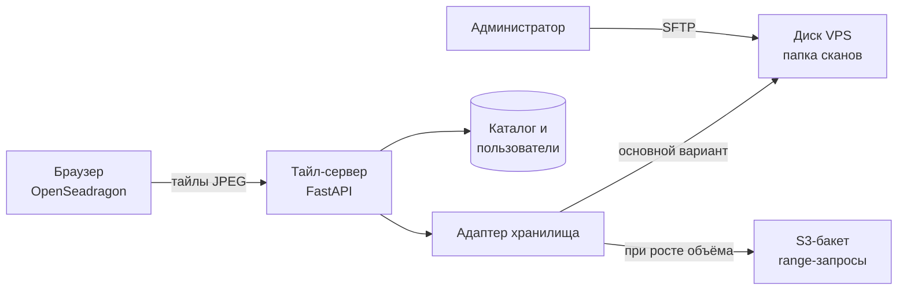

# ТЗ: веб-вьювер гистосканов для обучения резидентов

Версия от 2026-09-19, редакция 2

Изменения редакции 2:

- сервис и сканы сразу размещаются на VPS казахстанского провайдера, этап с Google Диском исключён;
- имена файлов в интерфейсе не отображаются и в браузер не передаются (раздел 3);
- сканы на сервер загружает администратор по SFTP; S3-совместимый бакет стал необязательным этапом на случай роста объёма.

## 1. Назначение и цели

Веб-вьювер показывает полнослайдовые гистологические сканы (WSI) в браузере, подгружая только видимые фрагменты, без скачивания файла целиком. Основное применение: обучение резидентов-гематологов на деидентифицированных сканах Центра гематологии.

Цели прототипа:

- открыть скан размером 0,3–3 ГБ с сервера за несколько секунд на обычном рабочем компьютере;
- дать просмотр на фиксированных увеличениях и плавный зум, как в Aperio ImageScope;
- дать настройку изображения: яркость, контраст, гамма, насыщенность, оттенок, цветовой баланс;
- разместить сервис и сканы на VPS казахстанского провайдера и сохранить возможность переноса сканов в S3-совместимый бакет без переписывания вьювера.

Вьювер предназначен для обучения и разборов. Для первичной диагностики он не используется.

## 2. Пользователи и сценарии

В прототипе три роли.

| Роль | Что делает |
| --- | --- |
| Резидент | Открывает слайд из каталога, смотрит на разных увеличениях, настраивает изображение |
| Преподаватель | То же, плюс делится ссылкой на слайд с конкретным полем зрения и увеличением |
| Администратор | Загружает сканы на сервер по SFTP, ведёт каталог (код случая, номер стекла, окраска, описание), управляет доступом |

Основные сценарии:

1. Резидент входит в систему, выбирает случай в каталоге и открывает стекло.
2. Резидент осматривает препарат на обзорном увеличении, затем переходит на 10×, 20×, 40× в интересующих зонах.
3. При бледной или перекрашенной окраске резидент корректирует яркость, контраст, гамму и цвет, при необходимости сбрасывает настройки.
4. Преподаватель на занятии отправляет группе ссылку, которая открывает слайд в том же месте и на том же увеличении.

## 3. Данные

В хранилище попадают только деидентифицированные файлы: внутренний ИД пациента и номер стекла, без ФИО, ИИН, даты рождения и номера истории болезни.

**Форматы.** Обязательный формат: Aperio SVS (сжатие JPEG). Стёкла сканируются на 20× и 40×, вьювер поддерживает оба варианта. Другие форматы (NDPI, MRXS и др.) в прототип не входят.

**Именование файлов.** Шаблон: `<ИД пациента>_<номер стекла>_<окраска>.svs`, например `P004512_S03_HE.svs`. Допустимы латиница, цифры, дефис и подчёркивание. Каталог разбирает имя файла и заполняет поля автоматически, администратор может их поправить.

**Имена файлов в интерфейсе.** Имя файла нигде не отображается, не передаётся в браузер и не пишется в журнал сервера. Слайд обозначается полями каталога: код случая, номер стекла, окраска. Если имя файла не соответствует шаблону, слайд получает нейтральный код (например, «Слайд 9FC486»), а поля заполняет администратор. Адреса страниц и ссылки на поле зрения содержат только внутренний идентификатор слайда.

**Деидентификация до загрузки.** Выполняет лаборант на компьютере лаборатории с помощью утилиты, которая входит в состав работ. Утилита имеет простое окно без командной строки: выбрать файл, ввести ИД пациента, номер стекла и окраску, получить готовый файл и отчёт о том, что удалено. Утилита делает:

- удаление label-изображения (фото этикетки стекла) и macro-изображения из файла;
- очистка текстовых метаданных: имя файла сканера, дата и время сканирования, имя оператора, штрихкод;
- переименование по шаблону выше;
- сохранение технических метаданных, нужных вьюверу: размер пикселя (мкм/пиксель), объектив сканирования, размеры уровней пирамиды.

Таблица соответствия внутреннего ИД и пациента хранится только в Центре и в систему не загружается.

**Загрузка на сервер.** Готовые файлы администратор копирует в папку сканов на сервере по SFTP (например, через WinSCP) под отдельной учётной записью, у которой есть доступ только к этой папке. Сервер находит новые файлы при синхронизации каталога (К-5). Загрузка файлов через веб-интерфейс в прототип не входит.

## 4. Архитектура

Сервис и сканы размещаются на одном VPS казахстанского провайдера. Браузер получает тайлы от тайл-сервера, а тайл-сервер читает из хранилища только нужные участки файла. Хранилище подключается через адаптер, поэтому перенос сканов с диска сервера в бакет меняет только модуль доступа к хранилищу.

Браузер никогда не обращается к хранилищу напрямую, поэтому смена диска сервера на бакет не затрагивает клиентскую часть.

| Компонент | Требование |
| --- | --- |
| Клиент | Одностраничное веб-приложение на OpenSeadragon, без установки плагинов |
| Тайл-сервер | Python, FastAPI; чтение слайдов через OpenSlide (диск сервера) или tiffslide + fsspec (бакет); выдача тайлов по протоколу DeepZoom |
| Адаптер хранилища | Единый интерфейс «открыть слайд по ключу». Реализации: папка на диске сервера, S3-совместимый бакет. Выбор через файл конфигурации |
| Кэш | Дисковый кэш готовых тайлов на сервере, лимит объёма задаётся в конфигурации (по умолчанию 20 ГБ), вытеснение по давности |
| Каталог | PostgreSQL или SQLite: слайды, случаи, пользователи, роли |
| Развёртывание | Docker Compose на одном VPS казахстанского провайдера (от 2 vCPU, 4 ГБ ОЗУ; SSD по объёму сканов плюс 40 ГБ на систему и кэш: для 10–20 тестовых сканов хватит 80 ГБ, с возможностью расширения), HTTPS через обратный прокси, доменное имя |

**Основной вариант, диск сервера.** Сканы лежат в папке на диске VPS. Тайл-сервер подключает её только для чтения. Администратор пополняет папку по SFTP. Исходные сканы остаются в архиве Центра, на сервере хранится рабочая копия.

**Необязательный этап, бакет.** Если объём сканов перерастёт разумный размер диска VPS, файлы переносятся в S3-совместимое объектное хранилище того же провайдера командой `rclone copy`. Ключи слайдов в каталоге не меняются, меняется только конфигурация адаптера.

Все данные и сервис находятся на территории Казахстана. Зарубежные облачные хранилища не используются.

## 5. Интерфейс

Компоновка экрана повторяет Aperio ImageScope: слева список слайдов, в центре изображение, поверх него панель увеличений и мини-карта, внизу строка состояния. Строка меню и большая часть панели инструментов убраны.

| Зона | Расположение | Содержимое |
| --- | --- | --- |
| Верхняя панель | Сверху, одна строка высотой до 48 px | Название слайда (код случая, стекло, окраска); кнопки: «Каталог», «Настройка изображения», «Сброс вида», «Во весь экран», «Ссылка на поле зрения»; имя пользователя и выход |
| Панель слайдов | Слева, ширина 180–200 px, сворачивается | Миниатюры стёкол текущего случая с подписью. Клик открывает стекло в основном окне |
| Основное окно | Центр, всё оставшееся место | Изображение слайда. Перетаскивание мышью, зум колесом |
| Панель увеличений | Поверх изображения, слева вверху | Вертикальный ряд кнопок: Fit, 2×, 4×, 10×, 20×, 40×; ползунок; поле с текущим увеличением (например, 4,8×) на жёлтом фоне, как в ImageScope |
| Мини-карта | Поверх изображения, справа вверху | Обзор всего препарата с рамкой текущего поля зрения. Клик или перетаскивание рамки перемещает вид. Сворачивается |
| Масштабная линейка | Поверх изображения, слева внизу | Отрезок с подписью в мкм или мм, пересчитывается при зуме |
| Панель настройки изображения | Выдвигается справа, ширина около 300 px | Ползунки из раздела 7. Не перекрывает панель увеличений и мини-карту |
| Строка состояния | Снизу, одна строка | Размер изображения в пикселях, координаты курсора, текущее увеличение, размер пикселя (мкм), индикатор загрузки тайлов |

Что убрано по сравнению с ImageScope в прототипе: строка меню, инструменты аннотаций и измерений, синхронизация нескольких окон, анализ изображений, экспорт областей.

Требования к оформлению:

- светлая нейтральная тема, фон вокруг препарата светло-серый, чтобы не искажать восприятие окраски;
- язык интерфейса русский, архитектура строк допускает добавление казахского и английского;
- минимальная поддерживаемая ширина экрана 1280 px; на планшете панель слайдов свёрнута по умолчанию;
- все элементы управления имеют всплывающие подсказки и доступны с клавиатуры.

## 6. Навигация и увеличения

Увеличение показывается в привычных микроскопических единицах (2×–40×) и рассчитывается от объектива сканирования, записанного в метаданных файла.

| № | Требование |
| --- | --- |
| Н-1 | Кнопки фиксированных увеличений: Fit (весь препарат), 2×, 4×, 10×, 20×, 40×. Кнопки выше увеличения сканирования неактивны (скан 20× не предлагает 40×) |
| Н-2 | Плавный зум колесом мыши с центром в точке курсора, ползунком, жестом на сенсорном экране. Диапазон: от Fit до 2× от увеличения сканирования (цифровой зум), далее зум ограничен |
| Н-3 | Текущее увеличение отображается числом с одним знаком после запятой и обновляется в реальном времени |
| Н-4 | Если в метаданных нет объектива, увеличение вычисляется из размера пикселя (0,25 мкм/пиксель ≈ 40×, 0,5 мкм/пиксель ≈ 20×). Если нет и его, показывается процент от полного разрешения |
| Н-5 | Панорамирование перетаскиванием мышью, стрелками клавиатуры, перетаскиванием рамки на мини-карте |
| Н-6 | При смене увеличения сначала показывается растянутый тайл с предыдущего уровня, затем он заменяется чётким. Пустых белых областей во время загрузки быть не должно |
| Н-7 | Масштабная линейка в мкм или мм, корректная на любом увеличении |
| Н-8 | Горячие клавиши: `0` Fit, `1`–`5` фиксированные увеличения, `+`/`−` зум, стрелки панорамирование, `F` полный экран, `R` сброс вида |
| Н-9 | Ссылка на поле зрения: адрес страницы содержит слайд, координаты центра и увеличение. Открытие ссылки восстанавливает вид |
| Н-10 | Поворот изображения с шагом 90° (желательное требование) |

## 7. Настройка изображения

Все коррекции выполняются в браузере поверх уже загруженных тайлов (WebGL-шейдер или эквивалент). Исходный файл не меняется, повторная загрузка тайлов при движении ползунка не происходит.

| Параметр | Диапазон | По умолчанию | Назначение |
| --- | --- | --- | --- |
| Яркость | −100…+100 | 0 | Общий сдвиг светлоты |
| Контраст | −100…+100 | 0 | Растяжение или сжатие тонового диапазона |
| Гамма | 0,20…3,00 | 1,00 | Нелинейная коррекция средних тонов: проработка ядер в плотных, перекрашенных участках |
| Насыщенность | −100…+100 | 0 | Усиление бледной окраски; −100 даёт оттенки серого |
| Оттенок | −180°…+180° | 0° | Поворот цветового круга: компенсация сдвига цвета сканера или выцветшей окраски |
| Баланс красного | −100…+100 | 0 | Коррекция каналов по отдельности, как Color Balance в ImageScope |
| Баланс зелёного | −100…+100 | 0 | То же |
| Баланс синего | −100…+100 | 0 | То же |

Требования к поведению:

| № | Требование |
| --- | --- |
| И-1 | Результат виден в реальном времени при движении ползунка, без заметной задержки (не менее 30 кадров/с на встроенной графике) |
| И-2 | У каждого ползунка есть числовое поле для точного ввода. Двойной клик по ползунку возвращает значение по умолчанию |
| И-3 | Кнопка «Сбросить всё» возвращает все параметры к значениям по умолчанию |
| И-4 | Кнопка «До/После»: при удержании показывает исходное изображение без коррекций |
| И-5 | Порядок применения фиксирован и описан в документации: баланс каналов → яркость и контраст → гамма → насыщенность и оттенок |
| И-6 | Коррекции применяются ко всем уровням увеличения одинаково и сохраняются при зуме и панорамировании |
| И-7 | Настройки запоминаются для пользователя в браузере отдельно по каждому слайду. При открытии слайда с сохранёнными настройками на кнопке панели виден индикатор |
| И-8 | Пресеты: «Исходное», «Бледная окраска» (контраст и насыщенность выше), «Перекрашенный препарат» (гамма и яркость выше). Значения пресетов согласуются с заказчиком на тестовых сканах |
| И-9 | Пипетка белого: клик по пустому фону стекла выставляет баланс каналов так, чтобы фон стал нейтрально-белым (желательное требование) |
| И-10 | Мини-карта и миниатюры в панели слайдов показываются без коррекций |
| И-11 | Ссылка на поле зрения (Н-9) по выбору пользователя включает текущие настройки изображения |

## 8. Каталог слайдов и доступ

Каталог группирует стёкла по случаям (внутренний ИД пациента) и является стартовой страницей после входа.

| № | Требование |
| --- | --- |
| К-1 | Список случаев с миниатюрой первого стекла, кодом случая, числом стёкол, учебной темой |
| К-2 | Поля стекла: код случая, номер стекла, окраска (H&E, ретикулин, ИГХ-маркер и т. д.), ткань (трепанобиоптат, лимфоузел и др.), увеличение сканирования, размер файла, дата добавления |
| К-3 | Поля случая, заполняет администратор: учебная тема, краткое описание без персональных данных, диагноз. Диагноз можно скрыть от резидентов (режим «слепого» просмотра) |
| К-4 | Поиск по коду случая, фильтры по окраске, ткани и теме |
| К-5 | Синхронизация с хранилищем: сервер по расписанию и по кнопке находит новые файлы в папке, разбирает имя по шаблону из раздела 3, создаёт записи и миниатюры |
| К-6 | Вход по логину и паролю, пароли хранятся в виде хэша. Учётные записи создаёт администратор, самостоятельной регистрации нет |
| К-7 | Роли: резидент (просмотр), преподаватель (просмотр и ссылки), администратор (всё). Неавторизованный пользователь не получает ни страницу, ни тайлы |
| К-8 | Ссылка на поле зрения работает только для авторизованных пользователей |
| К-9 | Журнал: кто и когда открывал какой слайд (для учёта учебной активности) |

## 9. Нефункциональные требования

Целевые показатели измеряются на канале 20 Мбит/с и слайде 1 ГБ. Они одинаковы для диска сервера и для бакета.

| Показатель | Значение |
| --- | --- |
| Первое открытие слайда до обзорного вида | до 5 с |
| Повторное открытие (тайлы в кэше) | до 3 с |
| Полная прорисовка экрана после зума или сдвига | до 1,5 с |
| Одновременных пользователей без деградации | 5 (сейчас работают резидент и преподаватель, запас на рост группы) |
| Трафик на 10 минут просмотра одного слайда | до 150 МБ |

Прочие требования:

- **Браузеры.** Две последние версии Chrome, Edge, Firefox, Safari. Планшеты iPad и Android в горизонтальной ориентации.
- **Безопасность.** Только HTTPS. Тайлы отдаются по сессии авторизованного пользователя. Секреты (ключ подписи сессий, ключи доступа к бакету) лежат только на сервере, в переменных окружения. Доступ тайл-сервера к папке сканов только на чтение. На VPS открыты порты 80, 443 и SSH; вход по SSH только по ключам; учётная запись SFTP для загрузки сканов ограничена папкой сканов.
- **Размещение данных.** Сервис, сканы, каталог и резервные копии находятся у казахстанского провайдера.
- **Надёжность.** Недоступность хранилища показывается пользователю понятным сообщением, а не пустым экраном. Сервис перезапускается автоматически.
- **Сопровождение.** Исходный код передаётся заказчику в репозитории или архивом папки проекта с инструкцией по развёртыванию на VPS, описанием конфигурации и инструкцией по переносу сканов с диска сервера в бакет.
- **Лицензии.** Используются только компоненты с открытыми лицензиями, допускающими использование в организации (OpenSeadragon BSD, OpenSlide LGPL, tiffslide BSD).
- **Резервное копирование.** База каталога копируется ежедневно. Исходные сканы хранятся в архиве Центра, поэтому папка сканов на сервере восстанавливается повторной загрузкой; по возможности диск сервера покрывается снимками провайдера.

## 10. Этапы и приёмка

Работа делится на три этапа. Сроки ориентировочные, для одного разработчика.

| Этап | Состав | Срок | Результат |
| --- | --- | --- | --- |
| 1. Прототип на VPS | Утилита деидентификации; тайл-сервер с адаптером «папка на диске сервера»; вьювер с навигацией (раздел 6) и настройкой изображения (раздел 7); вход по паролю; простой список слайдов; развёртывание на VPS казахстанского провайдера с HTTPS; загрузка сканов по SFTP | 3–4 недели | Рабочий сервис на VPS, 10–20 тестовых сканов |
| 2. Каталог и роли | Каталог случаев, фильтры, роли, режим «слепого» просмотра, журнал, ссылки на поле зрения, правка полей слайда администратором | 2–3 недели | Сервис готов к занятиям с группой резидентов |
| 3. Перенос в бакет (необязательный) | Адаптер S3, перенос файлов, нагрузочная проверка, документация. Выполняется, если сканы перестают помещаться на диск VPS | 1–2 недели | Сервис работает из бакета, показатели раздела 9 достигнуты |

Критерии приёмки этапа 1:

- [ ] Тестовый SVS размером не менее 1 ГБ открывается с VPS по HTTPS, файл целиком на компьютер пользователя не скачивается (проверка по вкладке «Сеть» браузера)
- [ ] Кнопки Fit, 2×, 4×, 10×, 20×, 40× дают увеличение, совпадающее с ImageScope на том же файле с отклонением не более 5 %
- [ ] Масштабная линейка совпадает с измерением в ImageScope с отклонением не более 2 %
- [ ] Все восемь параметров раздела 7 работают в реальном времени, «Сбросить всё» и «До/После» работают
- [ ] В загруженных файлах нет label-изображения и идентифицирующих метаданных (проверка утилитой чтения метаданных)
- [ ] Неавторизованный запрос тайла возвращает отказ
- [ ] Имена файлов не встречаются ни в интерфейсе, ни в ответах сервера (проверка по вкладке «Сеть» браузера)
- [ ] Показатели раздела 9 выполнены на трёх тестовых слайдах

## 11. Вне рамок прототипа

В прототип не входят, но архитектура не должна им мешать:

- загрузка сканов через веб-интерфейс (в прототипе используется SFTP);
- аннотации преподавателя (контуры, стрелки, подписи, как на скриншоте ImageScope) и их показ резидентам;
- измерения расстояний и площадей;
- параллельный просмотр двух стёкол с синхронной навигацией (H&E рядом с ИГХ);
- учебные задания и тесты с привязкой к полям зрения;
- интеграция с ЛИС и МИС Центра;
- поддержка DICOM WSI и форматов других сканеров (MRXS, SCN, CZI);
- автоматический анализ изображений.

## 12. Открытые вопросы

Решено заказчиком: формат SVS; сканирование на 20× и 40×; объём сканов небольшой; деидентификацию выполняет лаборант; одновременно работают один резидент и один преподаватель; сервис сразу размещается на VPS казахстанского провайдера, этап с Google Диском исключён; имена файлов в интерфейсе не отображаются.

Остаётся уточнить:

- [ ] Какой казахстанский провайдер и тариф VPS? Есть ли у провайдера S3-совместимое хранилище и снимки диска?
- [ ] Какое доменное имя будет у сервиса (нужно для сертификата HTTPS)?
- [ ] Кто администрирует сервер и у кого будет доступ по SSH и SFTP?
- [ ] Нужен ли режим «слепого» просмотра (скрытый диагноз) уже на этапе 1?
- [ ] Сколько сканов примерно ожидается за первый год (для расчёта объёма хранилища и кэша)?
